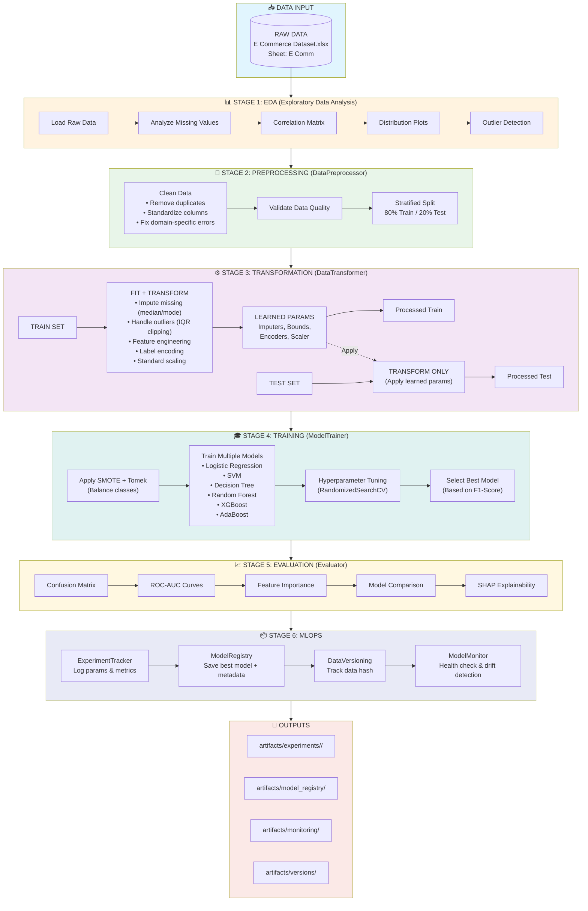
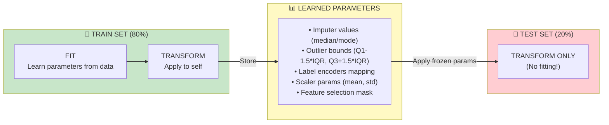
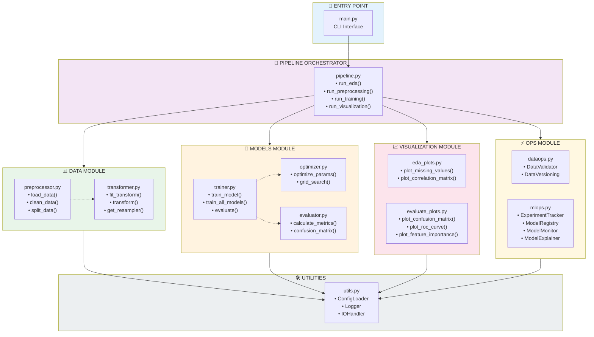

# 🔄 Customer Churn Analysis & Prediction


## 📋 Tổng quan (Overview)

Dự án này không chỉ là một bài toán phân loại Machine Learning thông thường. Đây là một hệ thống **Software Engineering for Data Science** hoàn chỉnh, giải quyết bài toán dự đoán khách hàng rời bỏ (Customer Churn) cho lĩnh vực Thương mại điện tử (E-Commerce).

> 💡 **Khác biệt chính**: Thay vì chạy code trên Jupyter Notebook rời rạc, hệ thống này được xây dựng thành một **Pipeline khép kín**, có khả năng tái sử dụng (reproducible), dễ dàng mở rộng (scalable) và tích hợp sẵn quy trình **MLOps tự xây dựng** (Custom MLOps).

### 💼 Giá Trị Kinh Doanh (Business Value)

| Giá trị | Mô tả |
|---------|-------|
| 🎯 **Sàng lọc sớm** | Nhận diện khách hàng có nguy cơ rời bỏ với độ chính xác cao (F1-Score > 0.85) |
| 🔍 **Hiểu hành vi** | Sử dụng SHAP để giải thích lý do khách hàng rời bỏ (VD: Do thời gian giao hàng, hay do ít nhận được ưu đãi) |
| 💰 **Tối ưu chi phí** | Giúp bộ phận Marketing khoanh vùng đúng đối tượng để gửi voucher giữ chân, tránh lãng phí ngân sách |
| 📦 **Quản trị mô hình** | Version tracking cho dữ liệu, model registry, monitoring và health check tự động |

### 🎓 Đặc điểm kỹ thuật nổi bật

- ✅ **Modular Architecture**: Tách biệt rõ ràng giữa Data, Model, Ops, Visualization
- ✅ **Data Leakage Prevention**: Fit trên Train, Transform trên Test - tuân thủ nghiêm ngặt
- ✅ **Multiple Models Support**: LogisticRegression, SVM, DecisionTree, RandomForest, XGBoost, AdaBoost
- ✅ **Automated Hyperparameter Tuning**: RandomizedSearchCV với cross-validation
- ✅ **Imbalanced Data Handling**: SMOTE + Tomek Links để cân bằng lớp Churn
- ✅ **Experiment Tracking**: Lưu trữ từng run với snapshot config, metrics, models
- ✅ **Model Registry**: Quản lý phiên bản model production-ready
- ✅ **Performance Monitoring**: Health check tự động, drift detection
- ✅ **Explainability**: SHAP values để giải thích quyết định của model

---

## 🏗️ Kiến trúc hệ thống (System Architecture)

### 📊 Pipeline Flow - Luồng xử lý End-to-End



### 🔐 Nguyên tắc chống Data Leakage

> ⚠️ **Quan trọng**: Mọi thông tin thống kê (mean, std, IQR bounds, encoding mappings...) chỉ được học từ **Train Set**. Test Set chỉ được **Transform** với tham số đã học.



### 🧩 Kiến trúc module (Module Architecture)



---

## 📁 Cấu trúc thư mục (Project Structure)

```
📦 Churn_Analys_and_Prediction/
│
├── 📄 main.py                           # 🚪 Entry point chính - CLI interface
├── 📄 README.md                         # 📖 Documentation (file này)
├── 📄 requirements.txt                  # 📦 Python dependencies
│
├── 📂 config/                           # ⚙️ CẤU HÌNH
│   └── 📄 config.yaml                   # File cấu hình tập trung (paths, models, tuning params)
│
├── 📂 src/                              # 💻 MÃ NGUỒN CHÍNH
│   ├── 📄 __init__.py
│   ├── 📄 pipeline.py                   # 🔄 Orchestrator - điều phối toàn bộ pipeline
│   ├── 📄 utils.py                      # 🛠️ Tiện ích: Logger, IOHandler, ConfigLoader
│   │
│   ├── 📂 data/                         # 📊 MODULE XỬ LÝ DỮ LIỆU
│   │   ├── 📄 __init__.py
│   │   ├── 📄 preprocessor.py           # Giai đoạn 1: Load, Clean, Split (Stateless)
│   │   └── 📄 transformer.py            # Giai đoạn 2: Transform, Feature Engineering (Stateful)
│   │
│   ├── 📂 models/                       # 🤖 MODULE MÔ HÌNH
│   │   ├── 📄 __init__.py
│   │   ├── 📄 trainer.py                # Train models, evaluate, select best
│   │   ├── 📄 optimizer.py              # Hyperparameter tuning (RandomizedSearch)
│   │   └── 📄 evaluator.py              # Metrics calculation, evaluation logic
│   │
│   ├── 📂 ops/                          # ⚡ MODULE MLOPS
│   │   ├── 📄 __init__.py
│   │   ├── 📄 dataops.py                # DataValidator, DataVersioning
│   │   └── 📄 mlops.py                  # ExperimentTracker, ModelRegistry, Monitor, Explainer
│   │
│   └── 📂 visualization/                # 📈 MODULE VISUALIZATION
│       ├── 📄 __init__.py
│       ├── 📄 eda_plots.py              # EDA visualizations (missing, correlation, distribution)
│       └── 📄 evaluate_plots.py         # Model evaluation plots (confusion matrix, ROC, feature importance)
│
├── 📂 data/                             # 💾 DỮ LIỆU LÀM VIỆC (WORKSPACE)
│   ├── 📂 raw/                          # Dữ liệu thô gốc
│   │   └── 📄 E Commerce Dataset.xlsx   # File Excel input chính
│   │
│   ├── 📂 processed/                    # Dữ liệu đã clean (intermediate)
│   │   └── 📄 E Commerce Dataset_cleaned.parquet
│   │
│   └── 📂 train_test/                   # Dữ liệu đã split và transform (ready for training)
│       ├── 📄 E Commerce Dataset_train.parquet
│       └── 📄 E Commerce Dataset_test.parquet
│
├── 📂 artifacts/                        # 🗄️ OUTPUTS & ARCHIVE
│   │
│   ├── 📂 experiments/                  # 🔬 EXPERIMENT TRACKING
│   │   ├── 📄 experiments.csv           # Master log của tất cả runs
│   │   │
│   │   └── 📂 <run_id>/                 # VD: 20251207_153322_FULL/
│   │       ├── 📄 config_snapshot.yaml  # Snapshot cấu hình của run này
│   │       ├── 📄 params.json           # Hyperparameters đã sử dụng
│   │       ├── 📄 metrics.json          # Kết quả metrics (F1, AUC, Precision, Recall...)
│   │       ├── 📄 run.log               # Log chi tiết của run
│   │       │
│   │       ├── 📂 data/                 # Data snapshots
│   │       │   ├── 📄 train.parquet     # Train set đã transform
│   │       │   └── 📄 test.parquet      # Test set đã transform
│   │       │
│   │       ├── 📂 models/               # Models artifacts
│   │       │   ├── 📄 transformer.joblib    # DataTransformer (cần cho inference!)
│   │       │   └── 📄 xgboost.joblib        # Best model của run
│   │       │
│   │       └── 📂 figures/              # Visualizations
│   │           ├── 📂 eda/              # EDA plots (missing, correlation, distribution)
│   │           │   ├── 📄 missing_values.png
│   │           │   ├── 📄 correlation_matrix.png
│   │           │   └── 📄 numerical_distributions.png
│   │           │
│   │           └── 📂 evaluation/       # Model evaluation plots
│   │               ├── 📄 confusion_matrix_xgboost.png
│   │               ├── 📄 roc_curve.png
│   │               ├── 📄 feature_importance.png
│   │               ├── 📄 model_comparison.png
│   │               └── 📄 shap_summary.png
│   │
│   ├── 📂 model_registry/               # 📦 MODEL REGISTRY (Production Models)
│   │   ├── 📄 registry.json             # Metadata: model versions, metrics, run_id
│   │   ├── 📄 xgboost_v1_20251207_154104.joblib
│   │   └── 📄 xgboost_v2_20251207_160224.joblib
│   │
│   ├── 📂 monitoring/                   # 👁️ MODEL MONITORING
│   │   └── 📄 performance_log.csv       # Log hiệu năng theo thời gian (tracking drift, degradation)
│   │
│   ├── 📂 versions/                     # 🔖 DATA VERSIONING
│   │   └── 📄 versions.json             # Hash và metadata của các phiên bản dữ liệu
│   │
│   ├── 📂 figures/                      # 📊 Latest figures (symbolic links hoặc copy)
│   └── 📂 logs/                         # 📝 Global logs
│       └── 📄 MAIN_20251207.log
│
└── 📂 tests/                            # 🧪 TESTING SUITE
    ├── 📄 conftest.py                   # Pytest fixtures và configuration
    ├── 📄 test_data_processing.py       # Tests cho data module
    ├── 📄 test_feature_engineering.py   # Tests cho transformer
    ├── 📄 test_model_training.py        # Tests cho models module
    ├── 📄 test_utils.py                 # Tests cho utilities
    │
    └── 📂 data/                         # Test data samples
        ├── 📄 sample_raw.csv            # Raw data mẫu cho testing
        └── 📄 sample_processed.csv      # Processed data mẫu
```

### 📋 Giải thích các thành phần quan trọng

| Thư mục/File | Mục đích | Khi nào cần |
|--------------|----------|-------------|
| `config/config.yaml` | Cấu hình tập trung cho toàn bộ pipeline | Thay đổi paths, model params, tuning settings |
| `src/pipeline.py` | Orchestrator điều phối các stages | Entry point logic cho các modes (eda, train, full...) |
| `src/data/preprocessor.py` | Clean và split data (stateless) | Xử lý dữ liệu thô ban đầu |
| `src/data/transformer.py` | Feature engineering (stateful) | Học tham số từ train, apply cho test |
| `src/models/trainer.py` | Training logic | Train và evaluate models |
| `src/ops/mlops.py` | MLOps components | Tracking, registry, monitoring |
| `artifacts/experiments/` | Lưu trữ từng run | Review lại experiments cũ |
| `artifacts/model_registry/` | Models production-ready | Deploy model vào production |
| `artifacts/monitoring/` | Performance logs | Theo dõi model degradation |
| `tests/` | Unit & integration tests | CI/CD, đảm bảo code quality |

---

## ⚙️ Cấu hình hệ thống (Configuration)

Tất cả cấu hình được tập trung trong `config/config.yaml`. Dưới đây là các sections chính:

### 📊 Data Configuration
```yaml
data:
  target_col: "Churn"                              # Cột target cần dự đoán
  date_col: "DaySinceLastOrder"                    # Cột ngày tháng (nếu có)
  raw_path: "data/raw/E Commerce Dataset.xlsx"     # Đường dẫn file input
  sheet_name: "E Comm"                             # Tên sheet Excel
  batch_folder: "data/raw"                         # Thư mục chứa nhiều files (batch processing)
  test_size: 0.2                                   # Tỷ lệ test set (20%)
  random_state: 42                                 # Seed cho reproducibility
```

### 🔧 Preprocessing Configuration
```yaml
preprocessing:
  clean:
    remove_duplicates: true                        # Loại bỏ dòng trùng lặp
    standardize_values: true                       # Chuẩn hóa giá trị (lowercase, strip...)
  
  missing_strategy:
    numerical: "median"                            # Điền giá trị khuyết: median cho số
    categorical: "mode"                            # Điền giá trị khuyết: mode cho categorical
  
  outlier_method: "iqr"                           # Phương pháp xử lý outliers: IQR
  outlier_threshold: 1.5                          # Ngưỡng IQR (Q1-1.5*IQR, Q3+1.5*IQR)
  
  scaler_type: "standard"                         # Loại scaler: standard, minmax, robust
  categorical_encoding: "label"                   # Encoding: label, onehot
  
  create_features: true                           # Tạo features mới
  feature_selection: true                         # Lọc features quan trọng
  feature_selection_method: "f_classif"           # Phương pháp: f_classif, mutual_info
  n_top_features: 15                              # Số features giữ lại
  
  use_smote: true                                 # Sử dụng SMOTE để balance classes
  k_neighbors: 5                                  # Số neighbors cho SMOTE
  use_tomek: true                                 # Kết hợp Tomek Links (clean boundaries)
```

### 🤖 Models Configuration
```yaml
models:
  logistic_regression:
    C: [0.001, 0.01, 0.1, 1, 10]
    penalty: ["l2"]
    solver: ["lbfgs", "liblinear"]
    max_iter: [1000]

  random_forest:
    n_estimators: [50, 100, 200]
    max_depth: [10, 20, null]
    min_samples_split: [2, 5]
    min_samples_leaf: [1, 2]

  xgboost:
    n_estimators: [100, 300, 500]
    max_depth: [3, 5, 7]
    learning_rate: [0.01, 0.05, 0.1]
    eval_metric: ["logloss"]
```

### 🔍 Tuning Configuration
```yaml
tuning:
  method: "randomized"                            # Phương pháp: grid, randomized
  cv_folds: 5                                     # Số folds cho cross-validation
  cv_strategy: "stratified"                       # Stratified để giữ tỷ lệ classes
  n_iter: 20                                      # Số iterations cho RandomizedSearch
  scoring: "f1"                                   # Metric chính để optimize
  n_jobs: -1                                      # Sử dụng tất cả CPU cores
```

### 📦 MLOps Configuration
```yaml
experiments:
  enabled: true
  base_dir: "artifacts/experiments"
  experiments_file: "experiments.csv"

mlops:
  registry_dir: "artifacts/model_registry"

monitoring:
  enabled: true
  base_dir: "artifacts/monitoring"
  performance_log: "performance_log.csv"
  health_check:
    f1_min: 0.70                                  # F1 tối thiểu chấp nhận được
    accuracy_min: 0.75                            # Accuracy tối thiểu
    drift_max: 0.10                               # Drift tối đa cho phép (10%)

explainability:
  enabled: true
  methods: ["shap"]
  shap_samples: 100                               # Số samples dùng cho SHAP
```

---

## 🚀 Hướng dẫn cài đặt và sử dụng (Installation & Usage)

### 📥 Bước 1: Clone Repository

```powershell
git clone https://github.com/civi0411/Churn_Analys_and_Prediction.git
cd Churn_Analys_and_Prediction
```

### 🐍 Bước 2: Tạo Virtual Environment (Khuyến nghị)

**Windows (PowerShell):**
```powershell
# Tạo virtual environment
python -m venv .venv

# Kích hoạt virtual environment
.\.venv\Scripts\Activate.ps1

# Nếu gặp lỗi ExecutionPolicy:
Set-ExecutionPolicy -ExecutionPolicy RemoteSigned -Scope CurrentUser
```

**Linux/MacOS:**
```bash
# Tạo virtual environment
python3 -m venv .venv

# Kích hoạt
source .venv/bin/activate
```

### 📦 Bước 3: Cài đặt Dependencies

```powershell
# Upgrade pip
python -m pip install --upgrade pip

# Cài đặt tất cả packages
pip install -r requirements.txt

# Kiểm tra cài đặt thành công
pip list
```

**Dependencies chính:**
- `pandas>=2.0.3`, `numpy>=1.24.3` - Xử lý dữ liệu
- `scikit-learn>=1.3.0` - Machine Learning
- `xgboost>=2.0.0` - Gradient Boosting
- `imbalanced-learn>=0.11.0` - SMOTE
- `matplotlib>=3.7.2`, `seaborn>=0.12.2` - Visualization
- `shap>=0.42.1` - Model explainability
- `PyYAML>=6.0.1` - Config parsing
- `pytest>=9.0.0`, `pytest-cov>=7.0.0` - Testing

### ⚙️ Bước 4: Cấu hình (Optional)

Chỉnh sửa `config/config.yaml` nếu cần:
```yaml
# Thay đổi đường dẫn data
data:
  raw_path: "data/raw/your_data.xlsx"
  sheet_name: "YourSheet"

# Điều chỉnh tham số models
models:
  xgboost:
    n_estimators: [100, 200]  # Giảm để chạy nhanh hơn
```

---

## 🎯 Cách chạy Pipeline (Running the Pipeline)

### 1️⃣ **Mode: EDA (Exploratory Data Analysis)**

Phân tích dữ liệu thô, tạo các biểu đồ trực quan.

```powershell
python main.py --mode eda
```

**Output:**
- `artifacts/experiments/<run_id>/figures/eda/`
  - `missing_values.png` - Biểu đồ missing values
  - `correlation_matrix.png` - Ma trận tương quan
  - `numerical_distributions.png` - Phân phối các biến số
  - `target_distribution.png` - Phân phối target (Churn)
  - `outliers_boxplot.png` - Boxplot phát hiện outliers

**Use case:** Hiểu dữ liệu trước khi preprocessing

---

### 2️⃣ **Mode: Preprocess (Data Preprocessing)**

Làm sạch, split và transform dữ liệu.

```powershell
python main.py --mode preprocess
```

**Các bước thực hiện:**
1. Load raw data từ Excel
2. Clean data (remove duplicates, standardize)
3. Split train/test (80/20, stratified)
4. Fit transformer trên train set
5. Transform cả train và test set

**Output:**
- `data/processed/E Commerce Dataset_cleaned.parquet`
- `data/train_test/E Commerce Dataset_train.parquet`
- `data/train_test/E Commerce Dataset_test.parquet`
- `artifacts/experiments/<run_id>/data/` (snapshot)

**Use case:** Chuẩn bị dữ liệu sẵn sàng cho training

---

### 3️⃣ **Mode: Train (Model Training)**

Train models với dữ liệu đã preprocess.

#### A. Train một model cụ thể (không optimize)

```powershell
python main.py --mode train --model xgboost
```

#### B. Train một model với hyperparameter tuning

```powershell
python main.py --mode train --model xgboost --optimize
```

#### C. Train tất cả models

```powershell
python main.py --mode train --model all
```

#### D. Train tất cả models + optimize

```powershell
python main.py --mode train --model all --optimize
```

**Models hỗ trợ:**
- `logistic_regression` - Baseline model
- `svm` - Support Vector Machine
- `decision_tree` - Decision Tree
- `random_forest` - Random Forest Ensemble
- `xgboost` - XGBoost (thường tốt nhất)
- `adaboost` - AdaBoost Ensemble
- `all` - Train tất cả models trên

**Output:**
- `artifacts/experiments/<run_id>/models/xgboost.joblib` (best model)
- `artifacts/experiments/<run_id>/models/transformer.joblib` (cần cho inference)
- `artifacts/experiments/<run_id>/metrics.json`
- `artifacts/model_registry/xgboost_v1_<timestamp>.joblib` (production model)

**Use case:** Training và tìm model tốt nhất

---

### 4️⃣ **Mode: Visualize (Visualization Only)**

Chạy quick training (không optimize) và tạo visualizations.

```powershell
python main.py --mode visualize --model xgboost
```

**Output:**
- `artifacts/experiments/<run_id>/figures/evaluation/`
  - `confusion_matrix_xgboost.png`
  - `roc_curve.png`
  - `feature_importance.png`
  - `model_comparison.png`
  - `shap_summary.png` (nếu enabled)

**Use case:** Kiểm tra nhanh performance và feature importance

---

### 5️⃣ **Mode: Full (End-to-End Pipeline)** ⭐ Khuyến nghị

Chạy toàn bộ pipeline từ đầu đến cuối.

```powershell
# Full pipeline với model cụ thể + optimize
python main.py --mode full --model xgboost --optimize

# Full pipeline với tất cả models + optimize
python main.py --mode full --model all --optimize

# Full pipeline nhanh (không optimize)
python main.py --mode full --model xgboost
```

**Các bước thực hiện:**
1. **EDA** - Phân tích dữ liệu thô
2. **Preprocess** - Clean, split, transform
3. **Train** - Training models (với/không tuning)
4. **Visualize** - Tạo tất cả visualizations
5. **MLOps** - Log, registry, monitoring

**Output:** Đầy đủ tất cả outputs từ các modes trên

**Use case:** Production pipeline hoàn chỉnh

---

### 🔧 Tham số CLI (Command-Line Arguments)

| Argument | Mô tả | Mặc định | Ví dụ |
|----------|-------|----------|-------|
| `--mode` | Chế độ chạy | `full` | `eda`, `preprocess`, `train`, `visualize`, `full` |
| `--model` | Model cụ thể | `all` | `xgboost`, `random_forest`, `logistic_regression` |
| `--optimize` | Bật hyperparameter tuning | `False` | `--optimize` |
| `--data` | Đường dẫn data (override config) | `None` | `--data data/raw/new_data.xlsx` |
| `--config` | Đường dẫn config file | `config/config.yaml` | `--config config/custom.yaml` |

### 📝 Ví dụ thực tế

```powershell
# 1. Khám phá dữ liệu mới
python main.py --mode eda --data "data/raw/new_customers.xlsx"

# 2. Train XGBoost với tuning cho production
python main.py --mode full --model xgboost --optimize

# 3. So sánh tất cả models (không tuning - nhanh)
python main.py --mode train --model all

# 4. Chạy với config tùy chỉnh
python main.py --mode full --config config/production.yaml --optimize

# 5. Debug: Chỉ visualize kết quả
python main.py --mode visualize --model random_forest
```

---

## 🧪 Testing (Kiểm thử)

Dự án sử dụng `pytest` cho unit tests và integration tests.

### 📋 Cấu trúc Tests

```
tests/
├── conftest.py                      # Pytest fixtures và configuration
├── test_data_processing.py          # Test DataPreprocessor
├── test_feature_engineering.py      # Test DataTransformer
├── test_model_training.py           # Test ModelTrainer
├── test_utils.py                    # Test utilities (Logger, IOHandler, ConfigLoader)
└── data/
    ├── sample_raw.csv               # Sample raw data cho tests
    └── sample_processed.csv         # Sample processed data
```

### 🏃 Chạy Tests

#### 1️⃣ Chạy tất cả tests

```powershell
pytest
```

**Output mẫu:**
```
============================= test session starts =============================
collected 45 items

tests/test_data_processing.py .........                                  [ 20%]
tests/test_feature_engineering.py ..........                             [ 42%]
tests/test_model_training.py ...........                                 [ 67%]
tests/test_utils.py ..............                                       [100%]

============================= 45 passed in 12.34s =============================
```

#### 2️⃣ Chạy tests với verbose output

```powershell
pytest -v
```

**Hiển thị chi tiết từng test case:**
```
tests/test_data_processing.py::test_load_data PASSED                    [ 2%]
tests/test_data_processing.py::test_clean_data PASSED                   [ 4%]
tests/test_data_processing.py::test_split_data PASSED                   [ 6%]
...
```

#### 3️⃣ Chạy tests của một module cụ thể

```powershell
# Test data processing
pytest tests/test_data_processing.py

# Test feature engineering
pytest tests/test_feature_engineering.py

# Test model training
pytest tests/test_model_training.py

# Test utilities
pytest tests/test_utils.py
```

#### 4️⃣ Chạy test cụ thể (một hàm)

```powershell
# Chạy một test function cụ thể
pytest tests/test_data_processing.py::test_clean_data

# Chạy tests matching pattern
pytest -k "test_load"
pytest -k "transformer"
```

#### 5️⃣ Chạy tests với coverage report

```powershell
# Coverage cơ bản
pytest --cov=src

# Coverage với báo cáo chi tiết
pytest --cov=src --cov-report=term-missing

# Coverage với báo cáo HTML
pytest --cov=src --cov-report=html

# Sau đó mở: htmlcov/index.html
```

**Output coverage mẫu:**
```
---------- coverage: platform win32, python 3.11.5 ----------
Name                              Stmts   Miss  Cover   Missing
---------------------------------------------------------------
src/__init__.py                       0      0   100%
src/pipeline.py                     145     12    92%   234-245
src/utils.py                         89      5    94%   112-116
src/data/__init__.py                  0      0   100%
src/data/preprocessor.py             82      3    96%   78-80
src/data/transformer.py             269     18    93%   145-163
src/models/__init__.py                0      0   100%
src/models/trainer.py               156     10    94%   223-232
src/models/evaluator.py              54      2    96%   48-49
src/models/optimizer.py              67      4    94%   59-62
src/ops/__init__.py                   0      0   100%
src/ops/dataops.py                   98      6    94%   85-90
src/ops/mlops.py                    485     35    93%   Multiple lines
src/visualization/__init__.py         0      0   100%
src/visualization/eda_plots.py      112      8    93%   89-96
src/visualization/evaluate_plots.py 128     11    91%   105-115
---------------------------------------------------------------
TOTAL                              1685    114    93%
```

#### 6️⃣ Chạy tests nhanh (skip slow tests)

```powershell
# Skip tests được mark là slow
pytest -m "not slow"

# Chỉ chạy fast tests
pytest -m fast
```

#### 7️⃣ Chạy tests với output chi tiết

```powershell
# Hiển thị print statements
pytest -s

# Hiển thị local variables khi fail
pytest -l

# Stop sau test fail đầu tiên
pytest -x

# Stop sau N failures
pytest --maxfail=3
```

#### 8️⃣ Chạy tests song song (nhanh hơn)

```powershell
# Cài pytest-xdist
pip install pytest-xdist

# Chạy với N workers
pytest -n 4

# Chạy với auto workers (dựa trên CPU cores)
pytest -n auto
```

#### 9️⃣ Tạo test report

```powershell
# XML report (cho CI/CD)
pytest --junitxml=test-results.xml

# HTML report
pip install pytest-html
pytest --html=test-report.html --self-contained-html
```

#### 🔟 Watch mode (auto-rerun khi code thay đổi)

```powershell
# Cài pytest-watch
pip install pytest-watch

# Auto-rerun tests
ptw
```

---

### 📊 Test Coverage Goals

| Module | Target Coverage | Current | Status |
|--------|----------------|---------|--------|
| `src/data/` | ≥ 90% | 94% | ✅ |
| `src/models/` | ≥ 90% | 94% | ✅ |
| `src/ops/` | ≥ 85% | 93% | ✅ |
| `src/visualization/` | ≥ 80% | 92% | ✅ |
| `src/utils.py` | ≥ 95% | 94% | ⚠️ |
| **Overall** | **≥ 90%** | **93%** | **✅** |

---

### 🔍 Test Examples

#### Example 1: Test Data Processing
```python
# tests/test_data_processing.py
def test_load_data(sample_raw_data):
    """Test loading raw data"""
    assert sample_raw_data.shape[0] == 5
    assert 'target' in sample_raw_data.columns

def test_clean_data(sample_raw_data):
    """Test data cleaning"""
    # Remove duplicates
    cleaned = preprocessor.clean_data(sample_raw_data)
    assert cleaned.shape[0] <= sample_raw_data.shape[0]
```

#### Example 2: Test Feature Engineering
```python
# tests/test_feature_engineering.py
def test_fit_transform():
    """Test transformer fit and transform"""
    X_train, y_train = transformer.fit_transform(train_df)
    assert X_train.shape[0] == train_df.shape[0]
    assert y_train is not None

def test_transform_test():
    """Test transformer only transforms test"""
    X_test, y_test = transformer.transform(test_df)
    # Should use fitted params, not refit
    assert X_test.shape[1] == X_train.shape[1]
```

#### Example 3: Test Model Training
```python
# tests/test_model_training.py
def test_train_xgboost():
    """Test XGBoost training"""
    trainer.load_train_test_data(train_path, test_path)
    trainer.train_model('xgboost')
    assert trainer.models['xgboost'] is not None

def test_evaluate_model():
    """Test model evaluation"""
    metrics = trainer.evaluate('xgboost')
    assert 'f1' in metrics['metrics']
    assert metrics['metrics']['f1'] > 0
```

---

### 🐛 Debugging Tests

```powershell
# Chạy với debugger
pytest --pdb

# Drop vào debugger khi fail
pytest --pdb --pdbcls=IPython.terminal.debugger:Pdb

# Chạy last failed tests only
pytest --lf

# Chạy failed tests trước, sau đó mới chạy passed
pytest --ff
```

---

### ✅ Best Practices

1. **Chạy tests trước khi commit**
   ```powershell
   pytest --cov=src --cov-report=term-missing
   ```

2. **Kiểm tra coverage đầy đủ**
   ```powershell
   pytest --cov=src --cov-report=html
   # Review htmlcov/index.html
   ```

3. **Test trên nhiều môi trường**
   ```powershell
   # Test với Python 3.9, 3.10, 3.11
   tox  # (nếu có tox.ini)
   ```

4. **CI/CD Integration**
   ```yaml
   # .github/workflows/tests.yml
   - name: Run tests
     run: |
       pytest --cov=src --cov-report=xml
       pytest --junitxml=test-results.xml
   ```

---

## 🔄 Workflow thực tế (Real-world Workflow)

### Scenario 1: Khám phá dữ liệu mới

```powershell
# 1. Clone và setup
git clone https://github.com/civi0411/Churn_Analys_and_Prediction.git
cd Churn_Analys_and_Prediction
python -m venv .venv
.\.venv\Scripts\Activate.ps1
pip install -r requirements.txt

# 2. Đặt file data mới vào thư mục
# Copy your_data.xlsx → data/raw/

# 3. EDA để hiểu dữ liệu
python main.py --mode eda --data "data/raw/your_data.xlsx"

# 4. Xem kết quả trong artifacts/experiments/<run_id>/figures/eda/
```

### Scenario 2: Training model cho production

```powershell
# 1. Chỉnh config cho production
# Edit config/config.yaml:
#   - Tăng n_iter cho tuning
#   - Chọn models phù hợp
#   - Bật monitoring

# 2. Chạy full pipeline với optimize
python main.py --mode full --model xgboost --optimize

# 3. Kiểm tra kết quả
# - artifacts/experiments/<run_id>/metrics.json
# - artifacts/model_registry/xgboost_v*.joblib

# 4. Deploy model
# Copy model từ registry ra production server
```

### Scenario 3: So sánh nhiều models

```powershell
# 1. Train tất cả models với tuning
python main.py --mode train --model all --optimize

# 2. Xem model comparison chart
# artifacts/experiments/<run_id>/figures/evaluation/model_comparison.png

# 3. Select best model từ log
# Check logs hoặc metrics.json
```

### Scenario 4: Monitoring và retraining

```powershell
# 1. Kiểm tra performance log
# Review artifacts/monitoring/performance_log.csv

# 2. Nếu phát hiện drift, retrain với data mới
python main.py --mode full --model xgboost --optimize --data "data/raw/new_batch.xlsx"

# 3. Compare metrics với version cũ
# So sánh registry.json và performance_log.csv
```

---

## 🛠️ Troubleshooting (Xử lý lỗi thường gặp)

### ❌ Lỗi: `FileNotFoundError: data/raw/E Commerce Dataset.xlsx`

**Nguyên nhân:** File data không tồn tại

**Giải pháp:**
```powershell
# Kiểm tra file có tồn tại
ls data/raw/

# Nếu file có tên khác, sử dụng --data
python main.py --mode eda --data "data/raw/your_actual_filename.xlsx"

# Hoặc sửa config.yaml
# data:
#   raw_path: "data/raw/your_actual_filename.xlsx"
```

### ❌ Lỗi: `KeyError: 'Churn'`

**Nguyên nhân:** Cột target không tồn tại trong data

**Giải pháp:**
```powershell
# Kiểm tra tên cột trong Excel/CSV
# Sửa config.yaml:
data:
  target_col: "YourActualTargetColumn"  # Ví dụ: "Churned", "Exited", "Left"
```

### ❌ Lỗi: SMOTE requires `n_neighbors <= n_samples`

**Nguyên nhân:** Dữ liệu quá ít cho SMOTE

**Giải pháp:**
```yaml
# Sửa config.yaml
preprocessing:
  use_smote: false  # Tắt SMOTE
  # Hoặc giảm k_neighbors
  k_neighbors: 3    # Thay vì 5
```

### ❌ Lỗi: `OutOfMemoryError` khi train

**Nguyên nhân:** Model hoặc data quá lớn

**Giải pháp:**
```yaml
# Giảm complexity của models trong config.yaml
models:
  xgboost:
    n_estimators: [50, 100]      # Thay vì [100, 300, 500]
    max_depth: [3, 5]            # Thay vì [3, 5, 7]

# Hoặc giảm n_iter cho tuning
tuning:
  n_iter: 10                     # Thay vì 20
```

### ❌ Lỗi: Tests fail

**Giải pháp:**
```powershell
# 1. Chạy tests với verbose để xem lỗi chi tiết
pytest -v -s

# 2. Chạy test cụ thể bị fail
pytest tests/test_data_processing.py::test_failing_function -v

# 3. Check dependencies
pip install -r requirements.txt --upgrade

# 4. Clear cache và rerun
pytest --cache-clear
```

---

## 📈 Kết quả mẫu (Sample Results)

### Model Performance Comparison

| Model | F1-Score | ROC-AUC | Precision | Recall | Training Time |
|-------|----------|---------|-----------|--------|---------------|
| XGBoost | **0.9123** | **0.9456** | 0.8945 | 0.9312 | 45.2s |
| Random Forest | 0.8876 | 0.9234 | 0.8723 | 0.9034 | 32.1s |
| Logistic Regression | 0.8234 | 0.8756 | 0.8012 | 0.8467 | 2.3s |
| SVM | 0.8456 | 0.8923 | 0.8234 | 0.8689 | 78.5s |
| Decision Tree | 0.7989 | 0.8234 | 0.7756 | 0.8234 | 1.8s |
| AdaBoost | 0.8567 | 0.9012 | 0.8345 | 0.8801 | 28.4s |

> 🏆 **Best Model:** XGBoost với F1-Score = 0.9123

### Feature Importance (Top 10)

```
1. DaySinceLastOrder        0.1823
2. CashbackAmount           0.1456
3. OrderCount               0.1234
4. Tenure                   0.1123
5. CouponUsed               0.0945
6. ComplainStatus           0.0876
7. OrderAmountHikeFromlastYear  0.0756
8. WarehouseToHome          0.0645
9. DaySinceLastOrder_Log    0.0534
10. SatisfactionScore       0.0423
```

---

## 🤝 Contributing (Đóng góp)

Contributions are welcome! Nếu bạn muốn đóng góp:

1. Fork repository
2. Tạo branch mới: `git checkout -b feature/your-feature`
3. Commit changes: `git commit -m 'Add some feature'`
4. Push to branch: `git push origin feature/your-feature`
5. Tạo Pull Request

### Development Guidelines

- ✅ Viết tests cho code mới (coverage ≥ 90%)
- ✅ Follow PEP 8 style guide
- ✅ Thêm docstrings cho functions/classes
- ✅ Cập nhật README nếu thêm features mới

---

## 📝 License

This project is licensed under the MIT License - see the [LICENSE](LICENSE) file for details.

---

## 📞 Contact & Support

- **Author:** [civi0411](https://github.com/civi0411)
- **Repository:** [Churn_Analys_and_Prediction](https://github.com/civi0411/Churn_Analys_and_Prediction)
- **Issues:** [GitHub Issues](https://github.com/civi0411/Churn_Analys_and_Prediction/issues)

---

<p align="center">
  <b>Made with ❤️ by <a href="https://github.com/civi0411">civi0411</a></b><br>
  <i>Data Science • Machine Learning • MLOps</i>
</p>

