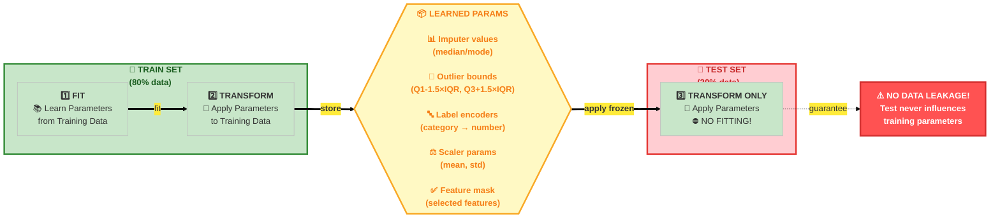
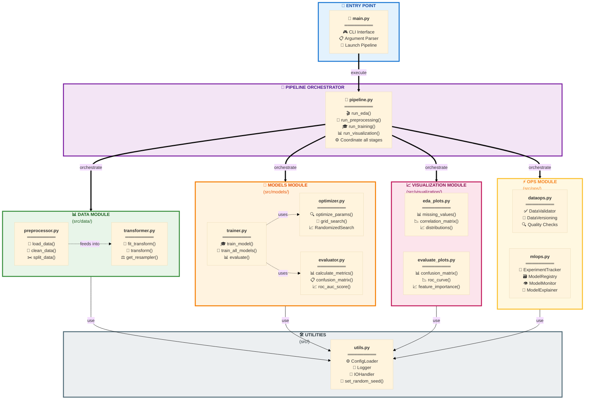

# Customer Churn Analysis & Prediction

## Overview

Dự án này không chỉ là một bài toán phân loại Machine Learning thông thường. Đây là một hệ thống Software Engineering for Data Science hoàn chỉnh, giải quyết bài toán dự đoán khách hàng rời bỏ (Customer Churn) cho lĩnh vực Thương mại điện tử (E-Commerce).

> Khác biệt chính: Thay vì chạy code trên Jupyter Notebook rời rạc, hệ thống này được xây dựng thành một Pipeline khép kín, có khả năng tái sử dụng (reproducible), dễ dàng mở rộng (scalable) và tích hợp sẵn quy trình MLOps tự xây dựng (Custom MLOps).

### Business Value

| Giá trị | Mô tả |
|---------|-------|
| Screening | Nhận diện khách hàng có nguy cơ rời bỏ với độ chính xác cao (F1-Score > 0.85) |
| Behavior Insights | Sử dụng SHAP để giải thích lý do khách hàng rời bỏ |
| Cost Optimization | Giúp bộ phận Marketing khoanh vùng đúng đối tượng để gửi voucher giữ chân |
| Model Governance | Version tracking cho dữ liệu, model registry, monitoring và health check tự động |

### Key Technical Features

- Modular Architecture: Tách biệt rõ ràng giữa Data, Model, Ops, Visualization
- Data Leakage Prevention: Fit trên Train, Transform trên Test - tuân thủ nghiêm ngặt
- Multiple Models Support: LogisticRegression, SVM, DecisionTree, RandomForest, XGBoost, AdaBoost
- Automated Hyperparameter Tuning: RandomizedSearchCV với cross-validation
- Imbalanced Data Handling: SMOTE + Tomek Links để cân bằng lớp Churn
- Experiment Tracking: Lưu trữ từng run với snapshot config, metrics, models
- Model Registry: Quản lý phiên bản model production-ready
- Performance Monitoring: Health check tự động, drift detection
- Explainability: SHAP values để giải thích quyết định của model

---

## System Architecture

### Pipeline Flow - Luồng xử lý End-to-End

```mermaid
%%{init: {'theme':'base', 'themeVariables': { 'primaryColor':'#e3f2fd','primaryTextColor':'#1565c0','primaryBorderColor':'#1976d2','lineColor':'#42a5f5','secondaryColor':'#fff3e0','tertiaryColor':'#e8f5e9'}}}%%
flowchart TB
    START(["🎬 START"])
    FINISH(["✨ FINISH"])
    
    INPUT[("📥 RAW DATA<br/><b>E Commerce Dataset</b><br/>Excel Sheet: E Comm")]
    
    subgraph S1 ["<b>📊 STAGE 1: EDA</b>"]
        direction TB
        B1["📂 Load Raw Data"]
        B2["🔍 Analyze Missing Values"]
        B3["📈 Correlation Matrix"]
        B4["📊 Distribution Plots"]
        B5["⚠️ Outlier Detection"]
        B1 ==> B2 ==> B3 ==> B4 ==> B5
    end

    subgraph S2 ["<b>🧹 STAGE 2: PREPROCESSING</b>"]
        direction TB
        C1["🔧 <b>Clean Data</b><br/>✓ Remove duplicates<br/>✓ Standardize columns<br/>✓ Fix errors"]
        C2["✅ Validate Quality"]
        C3["✂️ <b>Stratified Split</b><br/>80% Train | 20% Test"]
        C1 ==> C2 ==> C3
    end

    subgraph S3 ["<b>⚙️ STAGE 3: TRANSFORMATION</b>"]
        direction LR
        D1["🎯 <b>TRAIN SET</b>"]
        D2["🔨 <b>FIT + TRANSFORM</b><br/>• Impute missing<br/>• Clip outliers<br/>• Feature engineering<br/>• Encoding & Scaling"]
        D3{{"📦 <b>LEARNED PARAMS</b><br/>Imputers | Bounds<br/>Encoders | Scaler"}}
        D4["🧪 <b>TEST SET</b>"]
        D5["🎨 <b>TRANSFORM ONLY</b><br/>Apply learned params"]
        
        D1 ==> D2
        D2 ==> D3
        D3 -.->|"store"| D2
        D4 ==> D5
        D3 ==>|"apply"| D5
    end

    subgraph S4 ["<b>🎓 STAGE 4: TRAINING</b>"]
        direction TB
        E1["⚖️ <b>Balance Classes</b><br/>SMOTE + Tomek"]
        E2["🤖 <b>Train 6 Models</b><br/>LR | SVM | DT<br/>RF | XGB | Ada"]
        E3["🔍 <b>Hyperparameter Tuning</b><br/>RandomizedSearchCV"]
        E4["🏆 <b>Select Best Model</b><br/>Based on F1-Score"]
        E1 ==> E2 ==> E3 ==> E4
    end

    subgraph S5 ["<b>📈 STAGE 5: EVALUATION</b>"]
        direction TB
        F1["📊 Confusion Matrix"]
        F2["📉 ROC-AUC Curves"]
        F3["🎯 Feature Importance"]
        F4["📋 Model Comparison"]
        F5["🔬 SHAP Explainability"]
        F1 ==> F2 ==> F3 ==> F4 ==> F5
    end

    subgraph S6 ["<b>📦 STAGE 6: MLOPS</b>"]
        direction TB
        G1["📝 Experiment Tracker"]
        G2["🗃️ Model Registry"]
        G3["🔖 Data Versioning"]
        G4["👁️ Model Monitor"]
        G1 ==> G2 ==> G3 ==> G4
    end

    OUTPUT[("💾 <b>ARTIFACTS</b><br/>experiments/<br/>registry/<br/>monitoring/")]

    START ==> INPUT
    INPUT ==> S1
    S1 ==> S2
    S2 ==> S3
    S3 ==> S4
    S4 ==> S5
    S5 ==> S6
    S6 ==> OUTPUT
    OUTPUT ==> FINISH

    classDef startEnd fill:#4caf50,stroke:#2e7d32,stroke-width:3px,color:#fff,font-weight:bold
    classDef dataNode fill:#2196f3,stroke:#1565c0,stroke-width:3px,color:#fff,font-weight:bold
    classDef stage1 fill:#fff3e0,stroke:#f57c00,stroke-width:2px,color:#e65100
    classDef stage2 fill:#e8f5e9,stroke:#43a047,stroke-width:2px,color:#2e7d32
    classDef stage3 fill:#f3e5f5,stroke:#8e24aa,stroke-width:2px,color:#6a1b9a
    classDef stage4 fill:#e0f2f1,stroke:#00897b,stroke-width:2px,color:#00695c
    classDef stage5 fill:#fff8e1,stroke:#fbc02d,stroke-width:2px,color:#f57f17
    classDef stage6 fill:#e8eaf6,stroke:#5e35b1,stroke-width:2px,color:#4527a0
    
    class START,FINISH startEnd
    class INPUT,OUTPUT dataNode
    class S1 stage1
    class S2 stage2
    class S3 stage3
    class S4 stage4
    class S5 stage5
    class S6 stage6
```



### Nguyên tắc chống Data Leakage

> ⚠️ **QUAN TRỌNG**: Mọi thông tin thống kê (mean, std, IQR bounds, encoding mappings...) chỉ được học từ **Train Set**. Test Set chỉ được **Transform** với tham số đã học - **KHÔNG BAO GIỜ FIT LẠI!**



### Kiến trúc module (Module Architecture)



---

## 📂 Project Structure

```powershell
Churn_Analys_and_Prediction/
│
├── 📄 .gitignore                        # 🚫 Git ignore rules
├── 📄 main.py                           # 🚪 Entry point chính - CLI interface
├── 📄 README.md                         # 📖 Project documentation
├── 📄 requirements.txt                  # 📦 Python dependencies
│
├── 📂 config/                           # ⚙️ CẤU HÌNH
│   └── 📄 config.yaml                   # File cấu hình tập trung (paths, models, params)
│
├── 📂 notebook/                         # 📓 JUPYTER NOTEBOOKS
│   └── 📄 demo_pipeline.ipynb           # Demo luồng chạy của pipeline
│
├── 📂 src/                              # 💻 MÃ NGUỒN CHÍNH
│   ├── 📄 __init__.py
│   ├── 📄 pipeline.py                   # 🔄 Orchestrator - điều phối toàn bộ pipeline
│   ├── 📄 utils.py                      # 🛠️ Utilities (Logger, IO, ConfigLoader)
│   │
│   ├── 📂 data/                         # 📊 DATA PROCESSING MODULE
│   │   ├── 📄 __init__.py
│   │   ├── 📄 preprocessor.py           # Giai đoạn 1: Load, Clean, Split (Stateless)
│   │   └── 📄 transformer.py            # Giai đoạn 2: Transform, Feature Eng (Stateful)
│   │
│   ├── 📂 models/                       # 🤖 MODEL TRAINING MODULE
│   │   ├── 📄 __init__.py
│   │   ├── 📄 trainer.py                # Train logic, model selection
│   │   ├── 📄 optimizer.py              # Hyperparameter tuning
│   │   └── 📄 evaluator.py              # Metrics calculation logic
│   │
│   ├── 📂 ops/                          # ⚡ MLOPS & DATAOPS MODULE
│   │   ├── 📄 __init__.py
│   │   │
│   │   ├── 📂 dataops/                  # Data Operations
│   │   │   ├── 📄 drift_detector.py     # Phát hiện trôi dạt dữ liệu (Data Drift)
│   │   │   ├── 📄 validator.py          # Kiểm tra chất lượng dữ liệu (Schema/Values)
│   │   │   └── 📄 versioning.py         # Quản lý phiên bản dữ liệu
│   │   │
│   │   ├── 📂 mlops/                    # ML Operations
│   │   │   ├── 📄 explainer.py          # Model Interpretability (SHAP/LIME)
│   │   │   ├── 📄 monitoring.py         # Theo dõi hiệu năng model
│   │   │   ├── 📄 registry.py           # Quản lý, lưu/tải model artifacts
│   │   │   └── 📄 tracking.py           # Experiment tracking
│   │   │
│   │   └── 📂 report/                   # Reporting
│   │       └── 📄 generator.py          # Sinh báo cáo tự động
│   │
│   └── 📂 visualization/                # 📈 VISUALIZATION MODULE
│       ├── 📄 __init__.py
│       ├── 📄 eda_plots.py              # Biểu đồ phân tích khám phá (EDA)
│       └── 📄 evaluate_plots.py         # Biểu đồ đánh giá model (ROC, Confusion Matrix)
│
├── 📂 data/                             # 💾 DỮ LIỆU (LOCAL WORKSPACE)
│   ├── 📂 raw/                          # Dữ liệu thô gốc
│   ├── 📂 processed/                    # Dữ liệu đã làm sạch
│   └── 📂 train_test/                   # Dữ liệu đã split/transform để train
│
├── 📂 artifacts/                        # 🗄️ OUTPUTS & ARCHIVE (Generated at runtime)
│   ├── 📂 experiments/                  # Logs chi tiết từng lần chạy
│   ├── 📂 model_registry/               # Các model đã đóng gói cho production
│   ├── 📂 monitoring/                   # Logs giám sát hiệu năng
│   ├── 📂 versions/                     # Metadata các phiên bản dữ liệu
│   ├── 📂 figures/                      # Hình ảnh biểu đồ mới nhất
│   └── 📂 logs/                         # System logs
│
└── 📂 tests/                            # 🧪 TESTING SUITE (Pytest)
    ├── 📄 conftest.py                   # Fixtures config
    ├── 📄 test_pipeline.py              # Integration tests
    ├── 📄 test_utils.py                 # Unit tests cho utils
    ├── 📂 test_data/                    # Tests cho data processing
    ├── 📂 test_models/                  # Tests cho model logic
    ├── 📂 test_ops/                     # Tests cho MLOps/DataOps components
    └── 📂 test_visualization/           # Tests cho plotting functions
```


## ⚙️ Cấu hình hệ thống (Configuration)

Tất cả cấu hình được tập trung trong `config/config.yaml`. Dưới đây là các sections chính:

### 📊 Data Configuration
```yaml
data:
  target_col: "Churn"                        # Dùng cho train/test, transform, split
  date_col: "DaySinceLastOrder"                 # Dùng cho feature engineering
  base_dir: "data"                              # Đường dẫn dữ liệu
  raw_path: "data/raw/E Commerce Dataset.xlsx"  # Đường dẫn file gốc
  sheet_name: "E Comm"                          # Tên sheet Excel
  processed_dir: "data/processed"               # Thư mục dữ liệu đã xử lý
  train_test_dir: "data/train_test"             # Thư mục train/test
  test_size: 0.2                                # Tỷ lệ test (0.0 - 1.0)
  random_state: 42                              # Seed cho random
```

### 🔧 Preprocessing Configuration
```yaml
preprocessing:
  clean:
    remove_duplicates: true          # Xóa dòng trùng
    standardize_values: true         # Chuẩn hóa tên cột
  missing_strategy:
    numerical: "median"              # median hoặc mean
    categorical: "mode"              # mode hoặc unknown
  outlier_method: "iqr"              # iqr hoặc zscore
  outlier_threshold: 1.5             # Ngưỡng cho iqr (thường 1.5) hoặc zscore(thường 3.0)
  scaler_type: "standard"            # standard, minmax, robust
  categorical_encoding: "label"      # Chỉ hỗ trợ label
  create_features: true              # Tạo feature domain
  feature_selection: true            # Bật chọn đặc trưng
  feature_selection_method: "f_classif" # f_classif hoặc mutual_info
  n_top_features: 15                 # Số lượng feature chọn
  use_smote: true                    # Bật SMOTE
  k_neighbors: 5                     # Số k cho SMOTE
  use_tomek: true                    # Bật SMOTETomek
```

### 🤖 Models Configuration
```yaml
models:
  logistic_regression:
    C: [0.001, 0.01, 0.1, 1, 10]    # Các giá trị để tuning
    penalty: ["l2"]                 # Chỉ l2
    solver: ["lbfgs", "liblinear"]  # Các solver
    max_iter: [1000]                 # Số vòng lặp

  svm:
    C: [0.1, 1, 10]                  # Các giá trị để tuning
    kernel: ["rbf", "linear"]        # kernel rbf hoặc linear
    gamma: ["scale", "auto"]         # gamma scale hoặc auto
    probability: [true]              # Dự đoán xác suất

  decision_tree:
    max_depth: [6, 10, 16, null]     # Độ sâu cây
    min_samples_split: [2, 5, 10]    # Số mẫu split
    min_samples_leaf: [1, 2, 4]      # Số mẫu leaf

  random_forest:
    n_estimators: [50, 100, 200]     # Số cây
    max_depth: [10, 20, null]        # Độ sâu cây
    min_samples_split: [2, 5]        # Số mẫu split
    min_samples_leaf: [1, 2]         # Số mẫu leaf

  xgboost:
    n_estimators: [100, 300, 500]    # Số cây
    max_depth: [3, 5, 7]             # Độ sâu cây
    learning_rate: [0.01, 0.05, 0.1] # Tốc độ học
    eval_metric: ["logloss"]         # Chỉ logloss

  adaboost:
    n_estimators: [50, 100]          # Số cây
    learning_rate: [0.01, 0.1, 1.0]  # Tốc độ học
```

### 🔍 Tuning Configuration
```yaml
tuning:
  method: "randomized"               # randomized hoặc grid
  cv_folds: 5                        # Số fold cho CV
  cv_strategy: "stratified"          # Chiến lược CV
  n_iter: 20                         # Số lần lặp
  scoring: "f1"                      # Tiêu chí đánh giá
  n_jobs: -1                         # Số job
```

### 📦 Ops Configuration
```yaml
dataops:
  versions_dir: "artifacts/versions" # Quản lý version dữ liệu
  drift_detection:
    enabled: true                    # Bật/tắt kiểm tra drift
    pvalue_threshold: 0.05           # Ngưỡng kiểm tra drift
    max_drift_ratio: 0.2             # Tỷ lệ drift tối đa
    abort_on_critical: true          # Hủy nếu drift lớn
    sample_frac: 1.0                 # Tỷ lệ sample
    max_rows: null                   # Giới hạn số dòng
  business_rules:
    persist: true                    # Lưu báo cáo rules
    fail_on_violation: false         # Dừng nếu vi phạm rules

mlops:
  registry_dir: "artifacts/registry" # Lưu trạng thái transformer, model

experiments:
  enabled: true                      # Bật/tắt tracking
  base_dir: "artifacts/experiments" # Thư mục tracking

monitoring:
  enabled: true                      # Bật/tắt monitoring
  base_dir: "artifacts/monitoring"  # Thư mục monitoring
  health_check:
    f1_min: 0.70                     # Ngưỡng F1
    accuracy_min: 0.75               # Ngưỡng accuracy
    drift_max: 0.10                  # Ngưỡng drift

explainability:
  enabled: true                      # Bật/tắt SHAP
  methods: ["shap"]                 # Chỉ hỗ trợ shap
  shap_samples: 100                  # Số sample cho SHAP
```

---

## 🚀 Hướng dẫn cài đặt và sử dụng (Installation & Usage)

### 📥 Bước 1: Clone Repository

```powershell
git clone https://github.com/civi0411/Churn_Analys_and_Prediction.git
cd Churn_Analys_and_Prediction
```

### 🐍 Bước 2: Tạo Virtual Environment (Khuyến nghị)

**Windows (PowerShell):**
```powershell
# Tạo virtual environment
python -m venv .venv

# Kích hoạt virtual environment
.\.venv\Scripts\Activate.ps1

# Nếu gặp lỗi ExecutionPolicy:
Set-ExecutionPolicy -ExecutionPolicy RemoteSigned -Scope CurrentUser
```

**Linux/MacOS:**
```bash
# Tạo virtual environment
python3 -m venv .venv

# Kích hoạt
source .venv/bin/activate
```

### 📦 Bước 3: Cài đặt Dependencies

```powershell
# Upgrade pip
python -m pip install --upgrade pip

# Cài đặt tất cả packages
pip install -r requirements.txt

# Kiểm tra cài đặt thành công
pip list
```

#### 📋 Dependencies chi tiết (requirements.txt)

```
# --- Core Data Science (Xử lý dữ liệu nền tảng) ---
numpy>=1.24.3           # Tính toán ma trận, số học
pandas>=2.0.3           # Xử lý DataFrame (Tối ưu bộ nhớ)
scipy>=1.11.0           # Thống kê khoa học (Dùng cho Drift Detection)
openpyxl>=3.1.2         # Engine đọc file Excel (.xlsx)
pyarrow>=10.0.0         # Backend xử lý dữ liệu lớn (Bắt buộc cho Parquet)
fastparquet>=2023.10.1  # Engine đọc/ghi file Parquet tối ưu

# --- Machine Learning Models ---
scikit-learn>=1.3.0     # Thư viện ML chính (Pipeline, Metrics, RF)
xgboost>=2.0.0          # Model Gradient Boosting (Mạnh mẽ)
imbalanced-learn>=0.11.0 # Hỗ trợ SMOTE (Xử lý dữ liệu mất cân bằng)

# --- Visualization (Trực quan hóa) ---
matplotlib>=3.7.2       # Vẽ biểu đồ cơ bản
seaborn>=0.12.2         # Vẽ biểu đồ thống kê đẹp

# --- Explainability (Giải thích mô hình) ---
shap>=0.42.1            # Giải thích lý do Churn (Feature Importance)

# --- Utilities & System (Cấu hình & Hệ thống) ---
PyYAML>=6.0.1           # Đọc file cấu hình config.yaml
joblib>=1.3.2           # Lưu/Tải model (.pkl) tốc độ cao
tqdm>=4.66.1            # Thanh tiến trình (Loading bar)
typing-extensions>=4.7.1 # Hỗ trợ Type Hinting

# --- Testing ---
pytest>=8.0.0           # Framework kiểm thử (Testing framework)
pytest-cov>=6.0.0       # Báo cáo độ bao phủ code (Coverage reporting)
```

### ⚙️ Bước 4: Cấu hình (Optional)

Chỉnh sửa `config/config.yaml` nếu cần:
```yaml
# Thay đổi đường dẫn data
data:
  raw_path: "data/raw/your_data.xlsx"
  sheet_name: "YourSheet"

# Điều chỉnh tham số models
models:
  xgboost:
    n_estimators: [100, 200]  # Giảm để chạy nhanh hơn
    max_depth: [3, 5]            # Thay vì [3, 5, 7]
```

---

## 🎯 Cách chạy Pipeline (Running the Pipeline)
#### 🖥️ CLI Arguments (Hướng dẫn chạy dòng lệnh)

Script `main.py` hỗ trợ các tham số sau để điều khiển luồng chạy của pipeline:

| Tham số | Kiểu | Mặc định | Tùy chọn (Choices) | Mô tả chi tiết |
| :--- | :---: | :---: | :--- | :--- |
| **`--mode`** | `str` | `full` | `full`, `preprocess`, `train`, `eda`, `visualize`, `predict` | Chế độ vận hành của Pipeline:<br>• `full`: Chạy toàn bộ (Data -> Train -> Eval)<br>• `eda`: Phân tích khám phá dữ liệu<br>• `predict`: Dự đoán trên dữ liệu mới |
| **`--data`** | `str` | *Config* | *Đường dẫn file* | Đường dẫn file dữ liệu đầu vào (Ghi đè cấu hình trong `config.yaml`).<br>Hỗ trợ đường dẫn tuyệt đối hoặc tương đối. |
| **`--model`** | `str` | `all` | *Tên model* | Chỉ định model cụ thể để huấn luyện/dự đoán (Ví dụ: `xgboost`, `random_forest`). |
| **`--optimize`** | `flag` | `False` | *(Không có)* | Thêm cờ này để bật chế độ **Hyperparameter Tuning** (Tinh chỉnh tham số mô hình). |
| **`--config`** | `str` | `config.yaml` | *Đường dẫn file* | Đường dẫn đến file cấu hình tùy chỉnh (nếu cần). |

### 💡 Usage Examples (Ví dụ)
**Mode: EDA (Exploratory Data Analysis)**

```powershell
# Phân tích dữ liệu thô, tạo các biểu đồ trực quan.
python main.py --mode eda
```
**Mode: Preprocess (Data Preprocessing)**

```powershell
# Làm sạch, split và transform dữ liệu.
python main.py --mode preprocess
```
 **Mode: Train (Model Training)**
```powershell
## Train một model cụ thể (không optimize)
python main.py --mode train 

# Train một model với hyperparameter tuning
python main.py --mode train --model xgboost --optimize

# Train tất cả models
python main.py --mode train --model all

# Train tất cả models + optimize
python main.py --mode train --model all --optimize
```
  **Mode: Visualize (Evaluation)**
```powershell
# Chạy quick training (không optimize) và tạo visualizations.
python main.py --mode visualize --model xgboost
```
**Mode: Full (End-to-End Pipeline)** ⭐ Khuyến nghị

```powershell
# Full pipeline với model cụ thể + optimize
python main.py --mode full --model xgboost --optimize

# Full pipeline với tất cả models + optimize
python main.py --mode full --model all --optimize

# Full pipeline nhanh (không optimize)
python main.py --mode full --model xgboost
```
**Mode: Predict (Dự đoán trên dữ liệu mới)**
```powershell
python main.py --mode predict --data "data/raw/your_new_data.xlsx"  
# ! Lưu ý phải train dataset trước khi thực hiện predict mẫu data mới
```
Chức năng này cho phép bạn sử dụng model đã huấn luyện để dự đoán trên **dữ liệu mới** (chưa từng train/test).

**Tham số:**
- `--data`: Đường dẫn file dữ liệu đầu vào (csv/xlsx/parquet). Nên là dữ liệu mới hoặc mẫu cần inference.

**Output:**
- File kết quả dự đoán sẽ được lưu tại: `artifacts/predictions/<ten_file>_predicted.csv`
- Trong file kết quả sẽ có thêm cột `prediction` (label dự đoán)

**Best Practice:**
- **Nên** dùng dữ liệu mới (chưa từng train/test) để đánh giá khả năng tổng quát hóa của model.
- **Không nên** dùng lại dữ liệu đã train/test để tránh data leakage.
- Có thể dùng sample nhỏ để kiểm thử kỹ thuật, nhưng nên là sample từ dữ liệu mới.

**Troubleshooting:**
- Nếu gặp lỗi về cột thiếu, hãy đảm bảo file input có đủ các cột như lúc train (trừ cột target).
- Nếu gặp lỗi thì xem thực hiện train trước với dataset mẫu rồi thực hiện predict dât mới nhé


## 🧪 Testing (Kiểm thử)

### 📊 Cấu trúc Tests

Tests được tổ chức theo cấu trúc module tương ứng với `src/`:

```powershell
tests/
├── conftest.py                    # Pytest fixtures chung
├── test_utils.py                  # Tests cho src/utils.py
├── test_pipeline.py               # Tests cho src/pipeline.py
├── test_data/
├── test_models/
├── test_ops/
│   ├── test_dataops/           # DataValidator, DataVersioning
│   └── test_mlops/              # ExperimentTracker, ModelRegistry, ModelMonitor
├── test_visualization/
```
### 🏃 Cách chạy Tests

```powershell
# Chạy tất cả tests
pytest

# Chạy module cụ thể
pytest tests/test_data/ -v                  # Data module
pytest tests/test_models/ -v                # Models module

# Chạy file cụ thể
pytest tests/test_data/test_preprocessor.py -v

# Chạy test case cụ thể
pytest tests/test_data/test_preprocessor.py::TestDataPreprocessor::test_clean_data -v
```
## 📖 Hướng dẫn Đọc & Phân tích Output
Sau khi chạy pipeline, toàn bộ kết quả, log và model sẽ được lưu tự động vào thư mục `artifacts/`. Dưới đây là cấu trúc tổ chức file đầu ra:

```powershell
artifacts/
├── experiments/                        # Lưu trữ kết quả từng lần chạy (Run History)
│   ├── 20251211_175911_FULL/           # Ví dụ một Run huấn luyện (Timestamp + Tag)
│   │   ├── data/                       # Dữ liệu snapshot dùng cho run này
│   │   ├── figures/                    # Biểu đồ trực quan hóa (EDA & EVAL)
│   │   ├── models/                     # Các file config và tham số model
│   │   ├── config_snapshot.yaml        # Snapshot cấu hình tại thời điểm chạy
│   │   ├── full.log                    # Log riêng của run này (mode_name.log)
│   │   ├── metrics.json                # Các chỉ số đánh giá (Accuracy, F1...)
│   │   ├── params.json                 # Các hyperparams đã dùng
│   │   └── report.md                   # Báo cáo tóm tắt tự động
│   |── 20251211_180205_PREDICT/        # Ví dụ một Run dự đoán
│   └── experiments.csv                 # Quản lý thí nghiệm
├── logs/                               # System Logs (Log hệ thống/Debug)
│   ├── MAIN_20251211_175911.log
│   └── ...
├── monitoring/                         
│   ├── alerts_log.csv                  # Cảnh báo data drift
│   └── performance_log.csv             # Giám sát hiệu năng
├── registry/                           # Kho chứa Model Production (Model Registry)
│   ├── registry.json                   # File quản lý phiên bản model
│   ├── transformer_state.joblib        # Pipeline xử lý dữ liệu
│   └── xgboost_v1_20251211_*.joblib    # File model đã huấn luyện
└── versions/
    └── versions.json                   # Quản lý version dữ liệu/code
```

### 1. 🧪 Thư mục `experiments/` (Quan trọng nhất)
Đây là nơi bạn kiểm tra kết quả huấn luyện hoặc dự đoán. Mỗi lần chạy tạo ra một thư mục con định dạng `YYYYMMDD_HHMMSS_[TAG]`.

* **`report.md` 
(Báo cáo tổng hợp nhanh tất cả từ EDA - TRAIN - MODEL - EVAL):**
    Đây là file tóm tắt nhanh kết quả chạy.
    > **💡 Mẹo xem file:**
    > * **Khuyên dùng:** Mở bằng **VSCode** và nhấn tổ hợp `Ctrl+Shift+V` để xem chế độ Preview đẹp nhất.
    > * **Lưu ý:** Nếu dùng **PyCharm**, chế độ preview mặc định thường hiển thị không tốt (bị vỡ layout). Bạn nên cài thêm plugin Markdown hoặc mở bằng editor khác.

* **`figures/`**: Thư mục chứa các file ảnh biểu đồ `.png`.
    * *Cách xem:* Double-click để mở bằng trình xem ảnh mặc định, hoặc dùng lệnh `Invoke-Item` nếu đang ở PowerShell.

* **`metrics.json` / `params.json`**: Chứa các con số chính xác về hiệu năng và tham số.
    * *Cách xem:* Mở bằng VSCode, Notepad hoặc kéo thả vào trình duyệt web để xem cấu trúc JSON.

* **Kết quả dự đoán (`*_PREDICT` folders):**
    Nếu bạn chạy pipeline dự đoán, kết quả thường nằm trong file `experiments.csv`.
    * *Cách xem:* Tốt nhất mở bằng **Excel**. Nếu file quá lớn, hãy dùng Python (Pandas) hoặc PowerShell để đọc vài dòng đầu (`Get-Content experiments.csv -Head 10`).

### 2. 🏭 Thư mục `registry/` (Model Registry)
Nơi lưu trữ "tài sản" quan trọng nhất: các model đã sẵn sàng hoặc đang được sử dụng.

* **`registry.json`**: File quan trọng nhất để hệ thống biết model nào đang là **Production** (đang chạy thực tế) hay **Staging**. Mở file này bằng Text Editor để kiểm tra phiên bản.
* **`*.joblib`**: Các file model nhị phân thực tế. **Không sửa đổi thủ công** các file này.

### 3. 📈 Thư mục `monitoring/` (Giám sát)
Dùng để theo dõi sức khỏe của mô hình theo thời gian.

* **`performance_log.csv`**: Lịch sử độ chính xác của model qua các lần đánh giá.
* **`alerts_log.csv`**: Ghi lại các cảnh báo (ví dụ: Data Drift - dữ liệu bị thay đổi phân phối).
    > **💡 Mẹo:** Các file này định dạng `.csv`, bạn nên mở bằng **Excel** để lọc/sort dữ liệu dễ dàng, hoặc dùng extension **Rainbow CSV** trong VSCode để xem nhanh.

### 4. 📝 Thư mục `logs/`
Chứa log thô của toàn bộ quá trình chạy (`MAIN_*.log`). Chỉ cần thiết khi bạn cần **Debug** lỗi (crash app, lỗi thư viện, lỗi code).