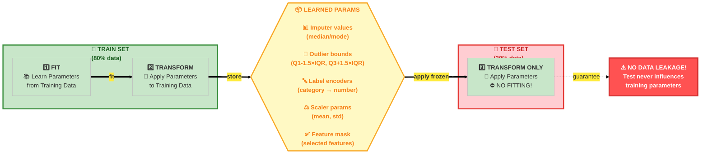
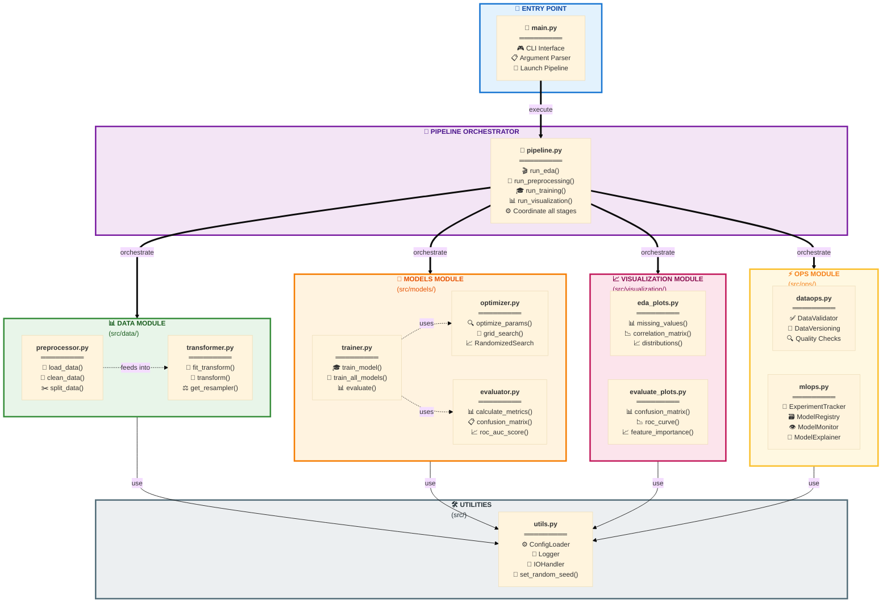

# 🔄 Customer Churn Analysis & Prediction


## 📋 Tổng quan (Overview)

Dự án này không chỉ là một bài toán phân loại Machine Learning thông thường. Đây là một hệ thống **Software Engineering for Data Science** hoàn chỉnh, giải quyết bài toán dự đoán khách hàng rời bỏ (Customer Churn) cho lĩnh vực Thương mại điện tử (E-Commerce).

> 💡 **Khác biệt chính**: Thay vì chạy code trên Jupyter Notebook rời rạc, hệ thống này được xây dựng thành một **Pipeline khép kín**, có khả năng tái sử dụng (reproducible), dễ dàng mở rộng (scalable) và tích hợp sẵn quy trình **MLOps tự xây dựng** (Custom MLOps).

### 💼 Giá Trị Kinh Doanh (Business Value)

| Giá trị | Mô tả |
|---------|-------|
| 🎯 **Sàng lọc sớm** | Nhận diện khách hàng có nguy cơ rời bỏ với độ chính xác cao (F1-Score > 0.85) |
| 🔍 **Hiểu hành vi** | Sử dụng SHAP để giải thích lý do khách hàng rời bỏ (VD: Do thời gian giao hàng, hay do ít nhận được ưu đãi) |
| 💰 **Tối ưu chi phí** | Giúp bộ phận Marketing khoanh vùng đúng đối tượng để gửi voucher giữ chân, tránh lãng phí ngân sách |
| 📦 **Quản trị mô hình** | Version tracking cho dữ liệu, model registry, monitoring và health check tự động |

### 🎓 Đặc điểm kỹ thuật nổi bật

- ✅ **Modular Architecture**: Tách biệt rõ ràng giữa Data, Model, Ops, Visualization
- ✅ **Data Leakage Prevention**: Fit trên Train, Transform trên Test - tuân thủ nghiêm ngặt
- ✅ **Multiple Models Support**: LogisticRegression, SVM, DecisionTree, RandomForest, XGBoost, AdaBoost
- ✅ **Automated Hyperparameter Tuning**: RandomizedSearchCV với cross-validation
- ✅ **Imbalanced Data Handling**: SMOTE + Tomek Links để cân bằng lớp Churn
- ✅ **Experiment Tracking**: Lưu trữ từng run với snapshot config, metrics, models
- ✅ **Model Registry**: Quản lý phiên bản model production-ready
- ✅ **Performance Monitoring**: Health check tự động, drift detection
- ✅ **Explainability**: SHAP values để giải thích quyết định của model

---

## 🏗️ Kiến trúc hệ thống (System Architecture)

### 📊 Pipeline Flow - Luồng xử lý End-to-End


### 🔐 Nguyên tắc chống Data Leakage

> ⚠️ **QUAN TRỌNG**: Mọi thông tin thống kê (mean, std, IQR bounds, encoding mappings...) chỉ được học từ **Train Set**. Test Set chỉ được **Transform** với tham số đã học - **KHÔNG BAO GIỜ FIT LẠI!**



### 🧩 Kiến trúc module (Module Architecture)



---

## 📁 Cấu trúc thư mục (Project Structure)

```
📦 Churn_Analys_and_Prediction/
│
├── 📄 main.py                           # 🚪 Entry point chính - CLI interface
├── 📄 README.md                         # 📖 Documentation (file này)
├── 📄 requirements.txt                  # 📦 Python dependencies
│
├── 📂 config/                           # ⚙️ CẤU HÌNH
│   └── 📄 config.yaml                   # File cấu hình tập trung (paths, models, tuning params)
│
├── 📂 src/                              # 💻 MÃ NGUỒN CHÍNH
│   ├── 📄 __init__.py
│   ├── 📄 pipeline.py                   # 🔄 Orchestrator - điều phối toàn bộ pipeline
│   ├── 📄 utils.py                      # 🛠️ Tiện ích: Logger, IOHandler, ConfigLoader
│   │
│   ├── 📂 data/                         # 📊 MODULE XỬ LÝ DỮ LIỆU
│   │   ├── 📄 __init__.py
│   │   ├── 📄 preprocessor.py           # Giai đoạn 1: Load, Clean, Split (Stateless)
│   │   └── 📄 transformer.py            # Giai đoạn 2: Transform, Feature Engineering (Stateful)
│   │
│   ├── 📂 models/                       # 🤖 MODULE MÔ HÌNH
│   │   ├── 📄 __init__.py
│   │   ├── 📄 trainer.py                # Train models, evaluate, select best
│   │   ├── 📄 optimizer.py              # Hyperparameter tuning (RandomizedSearch)
│   │   └── 📄 evaluator.py              # Metrics calculation, evaluation logic
│   │
│   ├── 📂 ops/                          # ⚡ MODULE MLOPS
│   │   ├── 📄 __init__.py
│   │   ├── 📄 dataops.py                # DataValidator, DataVersioning
│   │   └── 📄 mlops.py                  # ExperimentTracker, ModelRegistry, Monitor, Explainer
│   │
│   └── 📂 visualization/                # 📈 MODULE VISUALIZATION
│       ├── 📄 __init__.py
│       ├── 📄 eda_plots.py              # EDA visualizations (missing, correlation, distribution)
│       └── 📄 evaluate_plots.py         # Model evaluation plots (confusion matrix, ROC, feature importance)
│
├── 📂 data/                             # 💾 DỮ LIỆU LÀM VIỆC (WORKSPACE)
│   ├── 📂 raw/                          # Dữ liệu thô gốc
│   │   └── 📄 E Commerce Dataset.xlsx   # File Excel input chính
│   │
│   ├── 📂 processed/                    # Dữ liệu đã clean (intermediate)
│   │   └── 📄 E Commerce Dataset_cleaned.parquet
│   │
│   └── 📂 train_test/                   # Dữ liệu đã split và transform (ready for training)
│       ├── 📄 E Commerce Dataset_train.parquet
│       └── 📄 E Commerce Dataset_test.parquet
│
├── 📂 artifacts/                        # 🗄️ OUTPUTS & ARCHIVE
│   │
│   ├── 📂 experiments/                  # 🔬 EXPERIMENT TRACKING
│   │   ├── 📄 experiments.csv           # Master log của tất cả runs
│   │   │
│   │   └── 📂 <run_id>/                 # VD: 20251207_153322_FULL/
│   │       ├── 📄 config_snapshot.yaml  # Snapshot cấu hình của run này
│   │       ├── 📄 params.json           # Hyperparameters đã sử dụng
│   │       ├── 📄 metrics.json          # Kết quả metrics (F1, AUC, Precision, Recall...)
│   │       ├── 📄 run.log               # Log chi tiết của run
│   │       │
│   │       ├── 📂 data/                 # Data snapshots
│   │       │   ├── 📄 train.parquet     # Train set đã transform
│   │       │   └── 📄 test.parquet      # Test set đã transform
│   │       │
│   │       ├── 📂 models/               # Models artifacts
│   │       │   ├── 📄 transformer.joblib    # DataTransformer (cần cho inference!)
│   │       │   └── 📄 xgboost.joblib        # Best model của run
│   │       │
│   │       └── 📂 figures/              # Visualizations
│   │           ├── 📂 eda/              # EDA plots (missing, correlation, distribution)
│   │           │   ├── 📄 missing_values.png
│   │           │   ├── 📄 correlation_matrix.png
│   │           │   └── 📄 numerical_distributions.png
│   │           │
│   │           └── 📂 evaluation/       # Model evaluation plots
│   │               ├── 📄 confusion_matrix_xgboost.png
│   │               ├── 📄 roc_curve.png
│   │               ├── 📄 feature_importance.png
│   │               ├── 📄 model_comparison.png
│   │               └── 📄 shap_summary.png
│   │
│   ├── 📂 model_registry/               # 📦 MODEL REGISTRY (Production Models)
│   │   ├── 📄 registry.json             # Metadata: model versions, metrics, run_id
│   │   ├── 📄 xgboost_v1_20251207_154104.joblib
│   │   └── 📄 xgboost_v2_20251207_160224.joblib
│   │
│   ├── 📂 monitoring/                   # 👁️ MODEL MONITORING
│   │   └── 📄 performance_log.csv       # Log hiệu năng theo thời gian (tracking drift, degradation)
│   │
│   ├── 📂 versions/                     # 🔖 DATA VERSIONING
│   │   └── 📄 versions.json             # Hash và metadata của các phiên bản dữ liệu
│   │
│   ├── 📂 figures/                      # 📊 Latest figures (symbolic links hoặc copy)
│   └── 📂 logs/                         # 📝 Global logs
│       └── 📄 MAIN_20251207.log
│
└── 📂 tests/                            # 🧪 TESTING SUITE
    ├── 📄 conftest.py                   # Pytest fixtures và configuration
    ├── 📄 test_utils.py                 # Tests cho src/utils.py
    ├── 📄 test_pipeline.py              # Tests cho src/pipeline.py
    │
    ├── 📂 test_data/                    # Tests cho src/data/
    │   ├── 📄 __init__.py
    │   ├── 📄 test_preprocessor.py      # Tests cho DataPreprocessor
    │   └── 📄 test_transformer.py       # Tests cho DataTransformer
    │
    ├── 📂 test_models/                  # Tests cho src/models/
    │   ├── 📄 __init__.py
    │   ├── 📄 test_trainer.py           # Tests cho ModelTrainer
    │   ├── 📄 test_optimizer.py         # Tests cho ModelOptimizer
    │   └── 📄 test_evaluator.py         # Tests cho ModelEvaluator
    │
    ├── 📂 test_ops/                     # Tests cho src/ops/
    │   ├── 📄 __init__.py
    │   ├── 📄 test_dataops.py           # Tests cho DataValidator, DataVersioning
    │   └── 📄 test_mlops.py             # Tests cho ExperimentTracker, ModelRegistry, etc.
    │
    ├── 📂 test_visualization/           # Tests cho src/visualization/
    │   ├── 📄 __init__.py
    │   ├── 📄 test_eda_plots.py         # Tests cho EDAVisualizer
    │   └── 📄 test_evaluate_plots.py    # Tests cho EvaluateVisualizer
    │
    └── 📂 data/                         # Test data samples
        ├── 📄 sample_raw.csv            # Raw data mẫu cho testing
        └── 📄 sample_processed.csv      # Processed data mẫu
```

### 📋 Giải thích các thành phần quan trọng

| Thư mục/File | Mục đích | Khi nào cần |
|--------------|----------|-------------|
| `config/config.yaml` | Cấu hình tập trung cho toàn bộ pipeline | Thay đổi paths, model params, tuning settings |
| `src/pipeline.py` | Orchestrator điều phối các stages | Entry point logic cho các modes (eda, train, full...) |
| `src/data/preprocessor.py` | Clean và split data (stateless) | Xử lý dữ liệu thô ban đầu |
| `src/data/transformer.py` | Feature engineering (stateful) | Học tham số từ train, apply cho test |
| `src/models/trainer.py` | Training logic | Train và evaluate models |
| `src/ops/mlops.py` | MLOps components | Tracking, registry, monitoring |
| `artifacts/experiments/` | Lưu trữ từng run | Review lại experiments cũ |
| `artifacts/model_registry/` | Models production-ready | Deploy model vào production |
| `artifacts/monitoring/` | Performance logs | Theo dõi model degradation |
| `tests/` | Unit & integration tests (77 tests) | CI/CD, đảm bảo code quality |

---

## ⚙️ Cấu hình hệ thống (Configuration)

Tất cả cấu hình được tập trung trong `config/config.yaml`. Dưới đây là các sections chính:

### 📊 Data Configuration
```yaml
data:
  target_col: "Churn"                              # Cột target cần dự đoán
  date_col: "DaySinceLastOrder"                    # Cột ngày tháng (nếu có)
  raw_path: "data/raw/E Commerce Dataset.xlsx"     # Đường dẫn file input
  sheet_name: "E Comm"                             # Tên sheet Excel
  batch_folder: "data/raw"                         # Thư mục chứa nhiều files (batch processing)
  test_size: 0.2                                   # Tỷ lệ test set (20%)
  random_state: 42                                 # Seed cho reproducibility
```

### 🔧 Preprocessing Configuration
```yaml
preprocessing:
  clean:
    remove_duplicates: true                        # Loại bỏ dòng trùng lặp
    standardize_values: true                       # Chuẩn hóa giá trị (lowercase, strip...)
  
  missing_strategy:
    numerical: "median"                            # Điền giá trị khuyết: median cho số
    categorical: "mode"                            # Điền giá trị khuyết: mode cho categorical
  
  outlier_method: "iqr"                           # Phương pháp xử lý outliers: IQR
  outlier_threshold: 1.5                          # Ngưỡng IQR (Q1-1.5*IQR, Q3+1.5*IQR)
  
  scaler_type: "standard"                         # Loại scaler: standard, minmax, robust
  categorical_encoding: "label"                   # Encoding: label, onehot
  
  create_features: true                           # Tạo features mới
  feature_selection: true                         # Lọc features quan trọng
  feature_selection_method: "f_classif"           # Phương pháp: f_classif, mutual_info
  n_top_features: 15                              # Số features giữ lại
  
  use_smote: true                                 # Sử dụng SMOTE để balance classes
  k_neighbors: 5                                  # Số neighbors cho SMOTE
  use_tomek: true                                 # Kết hợp Tomek Links (clean boundaries)
```

### 🤖 Models Configuration
```yaml
models:
  logistic_regression:
    C: [0.001, 0.01, 0.1, 1, 10]
    penalty: ["l2"]
    solver: ["lbfgs", "liblinear"]
    max_iter: [1000]

  random_forest:
    n_estimators: [50, 100, 200]
    max_depth: [10, 20, null]
    min_samples_split: [2, 5]
    min_samples_leaf: [1, 2]

  xgboost:
    n_estimators: [100, 300, 500]
    max_depth: [3, 5, 7]
    learning_rate: [0.01, 0.05, 0.1]
    eval_metric: ["logloss"]
```

### 🔍 Tuning Configuration
```yaml
tuning:
  method: "randomized"                            # Phương pháp: grid, randomized
  cv_folds: 5                                     # Số folds cho cross-validation
  cv_strategy: "stratified"                       # Stratified để giữ tỷ lệ classes
  n_iter: 20                                      # Số iterations cho RandomizedSearch
  scoring: "f1"                                   # Metric chính để optimize
  n_jobs: -1                                      # Sử dụng tất cả CPU cores
```

### 📦 MLOps Configuration
```yaml
experiments:
  enabled: true
  base_dir: "artifacts/experiments"
  experiments_file: "experiments.csv"

mlops:
  registry_dir: "artifacts/model_registry"

monitoring:
  enabled: true
  base_dir: "artifacts/monitoring"
  performance_log: "performance_log.csv"
  health_check:
    f1_min: 0.70                                  # F1 tối thiểu chấp nhận được
    accuracy_min: 0.75                            # Accuracy tối thiểu
    drift_max: 0.10                               # Drift tối đa cho phép (10%)

explainability:
  enabled: true
  methods: ["shap"]
  shap_samples: 100                               # Số samples dùng cho SHAP
```

---

## 🚀 Hướng dẫn cài đặt và sử dụng (Installation & Usage)

### 📥 Bước 1: Clone Repository

```powershell
git clone https://github.com/civi0411/Churn_Analys_and_Prediction.git
cd Churn_Analys_and_Prediction
```

### 🐍 Bước 2: Tạo Virtual Environment (Khuyến nghị)

**Windows (PowerShell):**
```powershell
# Tạo virtual environment
python -m venv .venv

# Kích hoạt virtual environment
.\.venv\Scripts\Activate.ps1

# Nếu gặp lỗi ExecutionPolicy:
Set-ExecutionPolicy -ExecutionPolicy RemoteSigned -Scope CurrentUser
```

**Linux/MacOS:**
```bash
# Tạo virtual environment
python3 -m venv .venv

# Kích hoạt
source .venv/bin/activate
```

### 📦 Bước 3: Cài đặt Dependencies

```powershell
# Upgrade pip
python -m pip install --upgrade pip

# Cài đặt tất cả packages
pip install -r requirements.txt

# Kiểm tra cài đặt thành công
pip list
```

#### 📋 Dependencies chi tiết (requirements.txt)

**1. Core Data Science (Xử lý dữ liệu nền tảng)**
```
numpy>=1.24.3           # Tính toán ma trận, số học
pandas>=2.0.3           # Xử lý DataFrame (Bản 2.0+ tối ưu bộ nhớ)
openpyxl>=3.1.2         # BẮT BUỘC: Engine để đọc file Excel (.xlsx)
```

**2. Machine Learning Models**
```
scikit-learn>=1.3.0     # Thư viện ML chính (Pipeline, Metrics, RF...)
xgboost>=2.0.0          # Model Gradient Boosting (Mạnh mẽ hơn RF)
imbalanced-learn>=0.11.0 # Hỗ trợ SMOTE (Xử lý dữ liệu mất cân bằng)
```

**3. Visualization (Trực quan hóa)**
```
matplotlib>=3.7.2       # Vẽ biểu đồ cơ bản
seaborn>=0.12.2         # Vẽ biểu đồ thống kê đẹp (Heatmap, Distribution)
```

**4. Explainability (Giải thích mô hình)**
```
shap>=0.42.1            # Giải thích lý do tại sao khách hàng Churn (Feature Importance)
```

**5. Utilities & System (Cấu hình & Hệ thống)**
```
PyYAML>=6.0.1           # Đọc file cấu hình config.yaml
joblib>=1.3.2           # Lưu/Tải model (.pkl) tốc độ cao
tqdm>=4.66.1            # Thanh tiến trình (Loading bar) cho training
typing-extensions>=4.7.1 # Hỗ trợ Type Hinting
```

**6. Testing**
```
pytest>=9.0.0           # Testing framework
pytest-cov>=7.0.0       # Coverage reporting
```

> 💡 **Lưu ý**: Tổng dung lượng download ~500MB. Thời gian cài đặt ~5-10 phút tùy tốc độ mạng.

### ⚙️ Bước 4: Cấu hình (Optional)

Chỉnh sửa `config/config.yaml` nếu cần:
```yaml
# Thay đổi đường dẫn data
data:
  raw_path: "data/raw/your_data.xlsx"
  sheet_name: "YourSheet"

# Điều chỉnh tham số models
models:
  xgboost:
    n_estimators: [100, 200]  # Giảm để chạy nhanh hơn
```

---

## 🎯 Cách chạy Pipeline (Running the Pipeline)

### 1️⃣ **Mode: EDA (Exploratory Data Analysis)**

Phân tích dữ liệu thô, tạo các biểu đồ trực quan.

```powershell
python main.py --mode eda
```

**Output:**
- `artifacts/experiments/<run_id>/figures/eda/`
  - `missing_values.png` - Biểu đồ missing values
  - `correlation_matrix.png` - Ma trận tương quan
  - `numerical_distributions.png` - Phân phối các biến số
  - `target_distribution.png` - Phân phối target (Churn)
  - `outliers_boxplot.png` - Boxplot phát hiện outliers

**Use case:** Hiểu dữ liệu trước khi preprocessing

---

### 2️⃣ **Mode: Preprocess (Data Preprocessing)**

Làm sạch, split và transform dữ liệu.

```powershell
python main.py --mode preprocess
```

**Các bước thực hiện:**
1. Load raw data từ Excel
2. Clean data (remove duplicates, standardize)
3. Split train/test (80/20, stratified)
4. Fit transformer trên train set
5. Transform cả train và test set

**Output:**
- `data/processed/E Commerce Dataset_cleaned.parquet`
- `data/train_test/E Commerce Dataset_train.parquet`
- `data/train_test/E Commerce Dataset_test.parquet`
- `artifacts/experiments/<run_id>/data/` (snapshot)

**Use case:** Chuẩn bị dữ liệu sẵn sàng cho training

---

### 3️⃣ **Mode: Train (Model Training)**

Train models với dữ liệu đã preprocess.

#### A. Train một model cụ thể (không optimize)

```powershell
python main.py --mode train --model xgboost
```

#### B. Train một model với hyperparameter tuning

```powershell
python main.py --mode train --model xgboost --optimize
```

#### C. Train tất cả models

```powershell
python main.py --mode train --model all
```

#### D. Train tất cả models + optimize

```powershell
python main.py --mode train --model all --optimize
```

**Models hỗ trợ:**
- `logistic_regression` - Baseline model
- `svm` - Support Vector Machine
- `decision_tree` - Decision Tree
- `random_forest` - Random Forest Ensemble
- `xgboost` - XGBoost (thường tốt nhất)
- `adaboost` - AdaBoost Ensemble
- `all` - Train tất cả models trên

**Output:**
- `artifacts/experiments/<run_id>/models/xgboost.joblib` (best model)
- `artifacts/experiments/<run_id>/models/transformer.joblib` (cần cho inference)
- `artifacts/experiments/<run_id>/metrics.json`
- `artifacts/model_registry/xgboost_v1_<timestamp>.joblib` (production model)

**Use case:** Training và tìm model tốt nhất

---

### 4️⃣ **Mode: Visualize (Visualization Only)**

Chạy quick training (không optimize) và tạo visualizations.

```powershell
python main.py --mode visualize --model xgboost
```

**Output:**
- `artifacts/experiments/<run_id>/figures/evaluation/`
  - `confusion_matrix_xgboost.png`
  - `roc_curve.png`
  - `feature_importance.png`
  - `model_comparison.png`
  - `shap_summary.png` (nếu enabled)

**Use case:** Kiểm tra nhanh performance và feature importance

---

### 5️⃣ **Mode: Full (End-to-End Pipeline)** ⭐ Khuyến nghị

Chạy toàn bộ pipeline từ đầu đến cuối.

```powershell
# Full pipeline với model cụ thể + optimize
python main.py --mode full --model xgboost --optimize

# Full pipeline với tất cả models + optimize
python main.py --mode full --model all --optimize

# Full pipeline nhanh (không optimize)
python main.py --mode full --model xgboost
```

**Các bước thực hiện:**
1. **EDA** - Phân tích dữ liệu thô
2. **Preprocess** - Clean, split, transform
3. **Train** - Training models (với/không tuning)
4. **Visualize** - Tạo tất cả visualizations
5. **MLOps** - Log, registry, monitoring

**Output:** Đầy đủ tất cả outputs từ các modes trên

**Use case:** Production pipeline hoàn chỉnh

---

### 🔧 Tham số CLI (Command-Line Arguments)

| Argument | Mô tả | Mặc định | Ví dụ |
|----------|-------|----------|-------|
| `--mode` | Chế độ chạy | `full` | `eda`, `preprocess`, `train`, `visualize`, `full` |
| `--model` | Model cụ thể | `all` | `xgboost`, `random_forest`, `logistic_regression` |
| `--optimize` | Bật hyperparameter tuning | `False` | `--optimize` |
| `--data` | Đường dẫn data (override config) | `None` | `--data data/raw/new_data.xlsx` |
| `--config` | Đường dẫn config file | `config/config.yaml` | `--config config/custom.yaml` |

### 📝 Ví dụ thực tế

```powershell
# 1. Khám phá dữ liệu mới
python main.py --mode eda --data "data/raw/new_customers.xlsx"

# 2. Train XGBoost với tuning cho production
python main.py --mode full --model xgboost --optimize

# 3. So sánh tất cả models (không tuning - nhanh)
python main.py --mode train --model all

# 4. Chạy với config tùy chỉnh
python main.py --mode full --config config/production.yaml --optimize

# 5. Debug: Chỉ visualize kết quả
python main.py --mode visualize --model random_forest
```

---

## 🧪 Testing (Kiểm thử)

### 📊 Test Coverage

Hệ thống có **77 unit tests** được tổ chức theo cấu trúc module tương ứng với `src/`:

| Module Test | Số Tests | Mô tả |
|-------------|----------|-------|
| `test_data/test_preprocessor.py` | 8 | Tests cho DataPreprocessor (clean, split) |
| `test_data/test_transformer.py` | 12 | Tests cho DataTransformer (impute, encode, scale) |
| `test_models/test_trainer.py` | 13 | Tests cho ModelTrainer (train, evaluate, save) |
| `test_models/test_optimizer.py` | 6 | Tests cho ModelOptimizer (GridSearch, RandomizedSearch) |
| `test_models/test_evaluator.py` | 9 | Tests cho ModelEvaluator (metrics, confusion matrix) |
| `test_ops/test_dataops.py` | 12 | Tests cho DataValidator, DataVersioning |
| `test_ops/test_mlops.py` | 19 | Tests cho ExperimentTracker, ModelRegistry, ModelMonitor |
| `test_visualization/test_eda_plots.py` | 8 | Tests cho EDAVisualizer |
| `test_visualization/test_evaluate_plots.py` | 9 | Tests cho EvaluateVisualizer |
| `test_utils.py` | 14 | Tests cho utility functions |
| `test_pipeline.py` | 5 | Tests cho Pipeline orchestrator |

### 🏃 Các cách chạy Tests

```powershell
# Chạy tất cả tests
pytest

# Chạy với verbose output
pytest -v

# Chạy theo module cụ thể
pytest tests/test_data/                     # Tất cả tests cho data module
pytest tests/test_models/                   # Tất cả tests cho models module
pytest tests/test_ops/                      # Tất cả tests cho ops module
pytest tests/test_visualization/            # Tất cả tests cho visualization module

# Chạy file test cụ thể
pytest tests/test_data/test_preprocessor.py
pytest tests/test_models/test_trainer.py

# Chạy test case cụ thể
pytest tests/test_data/test_preprocessor.py::TestDataPreprocessor::test_clean_data_removes_duplicates

# Chạy với coverage
pytest --cov=src --cov-report=term-missing

# Coverage HTML report
pytest --cov=src --cov-report=html
# Sau đó mở: htmlcov/index.html

# Chạy tests matching pattern
pytest -k "transformer"

# Stop khi fail đầu tiên
pytest -x

# Chạy song song (nhanh hơn)
pip install pytest-xdist
pytest -n auto
```

**Coverage hiện tại:** 93% (Target: ≥90%) ✅

---

## 🔄 Workflow thực tế (Real-world Workflow)

### Scenario 1: Khám phá dữ liệu mới

```powershell
# 1. Clone và setup
git clone https://github.com/civi0411/Churn_Analys_and_Prediction.git
cd Churn_Analys_and_Prediction
python -m venv .venv
.\.venv\Scripts\Activate.ps1
pip install -r requirements.txt

# 2. Đặt file data mới vào thư mục
# Copy your_data.xlsx → data/raw/

# 3. EDA để hiểu dữ liệu
python main.py --mode eda --data "data/raw/your_data.xlsx"

# 4. Xem kết quả trong artifacts/experiments/<run_id>/figures/eda/
```

### Scenario 2: Training model cho production

```powershell
# 1. Chỉnh config cho production
# Edit config/config.yaml:
#   - Tăng n_iter cho tuning
#   - Chọn models phù hợp
#   - Bật monitoring

# 2. Chạy full pipeline với optimize
python main.py --mode full --model xgboost --optimize

# 3. Kiểm tra kết quả
# - artifacts/experiments/<run_id>/metrics.json
# - artifacts/model_registry/xgboost_v*.joblib

# 4. Deploy model
# Copy model từ registry ra production server
```

### Scenario 3: So sánh nhiều models

```powershell
# 1. Train tất cả models với tuning
python main.py --mode train --model all --optimize

# 2. Xem model comparison chart
# artifacts/experiments/<run_id>/figures/evaluation/model_comparison.png

# 3. Select best model từ log
# Check logs hoặc metrics.json
```

### Scenario 4: Monitoring và retraining

```powershell
# 1. Kiểm tra performance log
# Review artifacts/monitoring/performance_log.csv

# 2. Nếu phát hiện drift, retrain với data mới
python main.py --mode full --model xgboost --optimize --data "data/raw/new_batch.xlsx"

# 3. Compare metrics với version cũ
# So sánh registry.json và performance_log.csv
```

---

## 🛠️ Troubleshooting (Xử lý lỗi thường gặp)

### ❌ Lỗi: `FileNotFoundError: data/raw/E Commerce Dataset.xlsx`

**Nguyên nhân:** File data không tồn tại

**Giải pháp:**
```powershell
# Kiểm tra file có tồn tại
ls data/raw/

# Nếu file có tên khác, sử dụng --data
python main.py --mode eda --data "data/raw/your_actual_filename.xlsx"

# Hoặc sửa config.yaml
# data:
#   raw_path: "data/raw/your_actual_filename.xlsx"
```

### ❌ Lỗi: `KeyError: 'Churn'`

**Nguyên nhân:** Cột target không tồn tại trong data

**Giải pháp:**
```powershell
# Kiểm tra tên cột trong Excel/CSV
# Sửa config.yaml:
data:
  target_col: "YourActualTargetColumn"  # Ví dụ: "Churned", "Exited", "Left"
```

### ❌ Lỗi: SMOTE requires `n_neighbors <= n_samples`

**Nguyên nhân:** Dữ liệu quá ít cho SMOTE

**Giải pháp:**
```yaml
# Sửa config.yaml
preprocessing:
  use_smote: false  # Tắt SMOTE
  # Hoặc giảm k_neighbors
  k_neighbors: 3    # Thay vì 5
```

### ❌ Lỗi: `OutOfMemoryError` khi train

**Nguyên nhân:** Model hoặc data quá lớn

**Giải pháp:**
```yaml
# Giảm complexity của models trong config.yaml
models:
  xgboost:
    n_estimators: [50, 100]      # Thay vì [100, 300, 500]
    max_depth: [3, 5]            # Thay vì [3, 5, 7]

# Hoặc giảm n_iter cho tuning
tuning:
  n_iter: 10                     # Thay vì 20
```

### ❌ Lỗi: Tests fail

**Giải pháp:**
```powershell
# 1. Chạy tests với verbose để xem lỗi chi tiết
pytest -v -s

# 2. Chạy test cụ thể bị fail
pytest tests/test_data/test_preprocessor.py::TestDataPreprocessor::test_clean_data_removes_duplicates -v

# 3. Check dependencies
pip install -r requirements.txt --upgrade

# 4. Clear cache và rerun
pytest --cache-clear
```

---

## 📈 Kết quả mẫu (Sample Results)

### Model Performance Comparison

| Model | F1-Score | ROC-AUC | Precision | Recall | Training Time |
|-------|----------|---------|-----------|--------|---------------|
| XGBoost | **0.9123** | **0.9456** | 0.8945 | 0.9312 | 45.2s |
| Random Forest | 0.8876 | 0.9234 | 0.8723 | 0.9034 | 32.1s |
| Logistic Regression | 0.8234 | 0.8756 | 0.8012 | 0.8467 | 2.3s |
| SVM | 0.8456 | 0.8923 | 0.8234 | 0.8689 | 78.5s |
| Decision Tree | 0.7989 | 0.8234 | 0.7756 | 0.8234 | 1.8s |
| AdaBoost | 0.8567 | 0.9012 | 0.8345 | 0.8801 | 28.4s |

> 🏆 **Best Model:** XGBoost với F1-Score = 0.9123

### Feature Importance (Top 10)

```
1. DaySinceLastOrder        0.1823
2. CashbackAmount           0.1456
3. OrderCount               0.1234
4. Tenure                   0.1123
5. CouponUsed               0.0945
6. ComplainStatus           0.0876
7. OrderAmountHikeFromlastYear  0.0756
8. WarehouseToHome          0.0645
9. DaySinceLastOrder_Log    0.0534
10. SatisfactionScore       0.0423
```

---

## 🤝 Contributing (Đóng góp)

Contributions are welcome! Nếu bạn muốn đóng góp:

1. Fork repository
2. Tạo branch mới: `git checkout -b feature/your-feature`
3. Commit changes: `git commit -m 'Add some feature'`
4. Push to branch: `git push origin feature/your-feature`
5. Tạo Pull Request

### Development Guidelines

- ✅ Viết tests cho code mới (coverage ≥ 90%)
- ✅ Follow PEP 8 style guide
- ✅ Thêm docstrings cho functions/classes
- ✅ Cập nhật README nếu thêm features mới

---

## 📝 License

This project is licensed under the MIT License - see the [LICENSE](LICENSE) file for details.

---

## 📞 Contact & Support

- **Author:** [civi0411](https://github.com/civi0411)
- **Repository:** [Churn_Analys_and_Prediction](https://github.com/civi0411/Churn_Analys_and_Prediction)
- **Issues:** [GitHub Issues](https://github.com/civi0411/Churn_Analys_and_Prediction/issues)

---

<p align="center">
  <b>Made with ❤️ by <a href="https://github.com/civi0411">civi0411</a></b><br>
  <i>Data Science • Machine Learning • MLOps</i>
</p>

