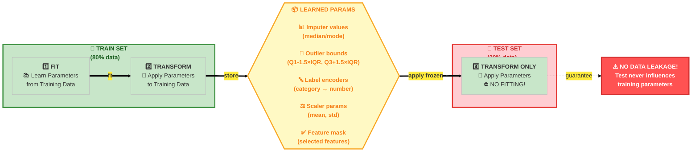
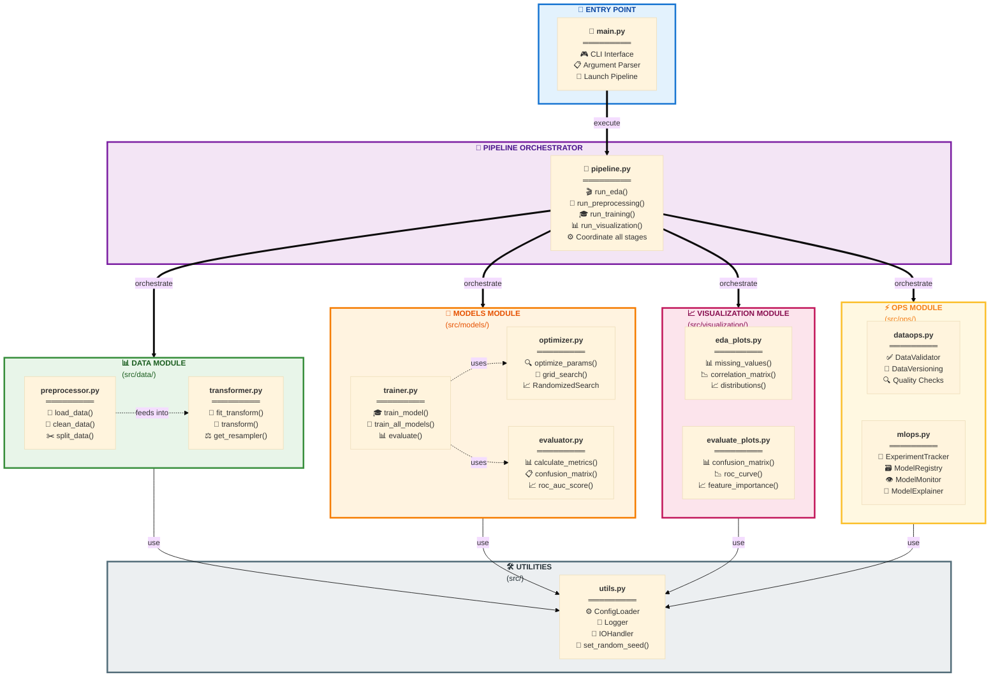

# Customer Churn Analysis & Prediction

## Overview

Dự án này không chỉ là một bài toán phân loại Machine Learning thông thường. Đây là một hệ thống Software Engineering for Data Science hoàn chỉnh, giải quyết bài toán dự đoán khách hàng rời bỏ (Customer Churn) cho lĩnh vực Thương mại điện tử (E-Commerce).

> Khác biệt chính: Thay vì chạy code trên Jupyter Notebook rời rạc, hệ thống này được xây dựng thành một Pipeline khép kín, có khả năng tái sử dụng (reproducible), dễ dàng mở rộng (scalable) và tích hợp sẵn quy trình MLOps tự xây dựng (Custom MLOps).

### Business Value

| Giá trị | Mô tả |
|---------|-------|
| Screening | Nhận diện khách hàng có nguy cơ rời bỏ với độ chính xác cao (F1-Score > 0.85) |
| Behavior Insights | Sử dụng SHAP để giải thích lý do khách hàng rời bỏ |
| Cost Optimization | Giúp bộ phận Marketing khoanh vùng đúng đối tượng để gửi voucher giữ chân |
| Model Governance | Version tracking cho dữ liệu, model registry, monitoring và health check tự động |

### Key Technical Features

- Modular Architecture: Tách biệt rõ ràng giữa Data, Model, Ops, Visualization
- Data Leakage Prevention: Fit trên Train, Transform trên Test - tuân thủ nghiêm ngặt
- Multiple Models Support: LogisticRegression, SVM, DecisionTree, RandomForest, XGBoost, AdaBoost
- Automated Hyperparameter Tuning: RandomizedSearchCV với cross-validation
- Imbalanced Data Handling: SMOTE + Tomek Links để cân bằng lớp Churn
- Experiment Tracking: Lưu trữ từng run với snapshot config, metrics, models
- Model Registry: Quản lý phiên bản model production-ready
- Performance Monitoring: Health check tự động, drift detection
- Explainability: SHAP values để giải thích quyết định của model

---

## System Architecture

### Pipeline Flow - Luồng xử lý End-to-End


### Nguyên tắc chống Data Leakage

> ⚠️ **QUAN TRỌNG**: Mọi thông tin thống kê (mean, std, IQR bounds, encoding mappings...) chỉ được học từ **Train Set**. Test Set chỉ được **Transform** với tham số đã học - **KHÔNG BAO GIỜ FIT LẠI!**



### Kiến trúc module (Module Architecture)



---

## 📂 Project Structure

```text
Churn_Analys_and_Prediction/
│
├── 📄 .gitignore                        # 🚫 Git ignore rules
├── 📄 main.py                           # 🚪 Entry point chính - CLI interface
├── 📄 README.md                         # 📖 Project documentation
├── 📄 requirements.txt                  # 📦 Python dependencies
│
├── 📂 config/                           # ⚙️ CẤU HÌNH
│   └── 📄 config.yaml                   # File cấu hình tập trung (paths, models, params)
│
├── 📂 notebook/                         # 📓 JUPYTER NOTEBOOKS
│   └── 📄 demo_pipeline.ipynb           # Demo luồng chạy của pipeline
│
├── 📂 src/                              # 💻 MÃ NGUỒN CHÍNH
│   ├── 📄 __init__.py
│   ├── 📄 pipeline.py                   # 🔄 Orchestrator - điều phối toàn bộ pipeline
│   ├── 📄 utils.py                      # 🛠️ Utilities (Logger, IO, ConfigLoader)
│   │
│   ├── 📂 data/                         # 📊 DATA PROCESSING MODULE
│   │   ├── 📄 __init__.py
│   │   ├── 📄 preprocessor.py           # Giai đoạn 1: Load, Clean, Split (Stateless)
│   │   └── 📄 transformer.py            # Giai đoạn 2: Transform, Feature Eng (Stateful)
│   │
│   ├── 📂 models/                       # 🤖 MODEL TRAINING MODULE
│   │   ├── 📄 __init__.py
│   │   ├── 📄 trainer.py                # Train logic, model selection
│   │   ├── 📄 optimizer.py              # Hyperparameter tuning
│   │   └── 📄 evaluator.py              # Metrics calculation logic
│   │
│   ├── 📂 ops/                          # ⚡ MLOPS & DATAOPS MODULE
│   │   ├── 📄 __init__.py
│   │   │
│   │   ├── 📂 dataops/                  # Data Operations
│   │   │   ├── 📄 drift_detector.py     # Phát hiện trôi dạt dữ liệu (Data Drift)
│   │   │   ├── 📄 validator.py          # Kiểm tra chất lượng dữ liệu (Schema/Values)
│   │   │   └── 📄 versioning.py         # Quản lý phiên bản dữ liệu
│   │   │
│   │   ├── 📂 mlops/                    # ML Operations
│   │   │   ├── 📄 explainer.py          # Model Interpretability (SHAP/LIME)
│   │   │   ├── 📄 monitoring.py         # Theo dõi hiệu năng model
│   │   │   ├── 📄 registry.py           # Quản lý, lưu/tải model artifacts
│   │   │   └── 📄 tracking.py           # Experiment tracking
│   │   │
│   │   └── 📂 report/                   # Reporting
│   │       └── 📄 generator.py          # Sinh báo cáo tự động
│   │
│   └── 📂 visualization/                # 📈 VISUALIZATION MODULE
│       ├── 📄 __init__.py
│       ├── 📄 eda_plots.py              # Biểu đồ phân tích khám phá (EDA)
│       └── 📄 evaluate_plots.py         # Biểu đồ đánh giá model (ROC, Confusion Matrix)
│
├── 📂 data/                             # 💾 DỮ LIỆU (LOCAL WORKSPACE)
│   ├── 📂 raw/                          # Dữ liệu thô gốc
│   ├── 📂 processed/                    # Dữ liệu đã làm sạch
│   └── 📂 train_test/                   # Dữ liệu đã split/transform để train
│
├── 📂 artifacts/                        # 🗄️ OUTPUTS & ARCHIVE (Generated at runtime)
│   ├── 📂 experiments/                  # Logs chi tiết từng lần chạy
│   ├── 📂 model_registry/               # Các model đã đóng gói cho production
│   ├── 📂 monitoring/                   # Logs giám sát hiệu năng
│   ├── 📂 versions/                     # Metadata các phiên bản dữ liệu
│   ├── 📂 figures/                      # Hình ảnh biểu đồ mới nhất
│   └── 📂 logs/                         # System logs
│
└── 📂 tests/                            # 🧪 TESTING SUITE (Pytest)
    ├── 📄 conftest.py                   # Fixtures config
    ├── 📄 test_pipeline.py              # Integration tests
    ├── 📄 test_utils.py                 # Unit tests cho utils
    ├── 📂 test_data/                    # Tests cho data processing
    ├── 📂 test_models/                  # Tests cho model logic
    ├── 📂 test_ops/                     # Tests cho MLOps/DataOps components
    └── 📂 test_visualization/           # Tests cho plotting functions
```


## ⚙️ Cấu hình hệ thống (Configuration)

Tất cả cấu hình được tập trung trong `config/config.yaml`. Dưới đây là các sections chính:

### 📊 Data Configuration
```yaml
data:
  target_col: "Churn"                              # Cột target cần dự đoán
  date_col: "DaySinceLastOrder"                    # Cột ngày tháng (nếu có)
  raw_path: "data/raw/E Commerce Dataset.xlsx"     # Đường dẫn file input
  sheet_name: "E Comm"                             # Tên sheet Excel
  test_size: 0.2                                   # Tỷ lệ test set (20%)
  random_state: 42                                 # Seed cho reproducibility
```

### 🔧 Preprocessing Configuration
```yaml
preprocessing:
  clean:
    remove_duplicates: true                        # Loại bỏ dòng trùng lặp
    standardize_values: true                       # Chuẩn hóa giá trị (lowercase, strip...)
  
  missing_strategy:
    numerical: "median"                            # Điền giá trị khuyết: median cho số
    categorical: "mode"                            # Điền giá trị khuyết: mode cho categorical
  
  outlier_method: "iqr"                           # Phương pháp xử lý outliers: IQR
  outlier_threshold: 1.5                          # Ngưỡng IQR (Q1-1.5*IQR, Q3+1.5*IQR)
  
  scaler_type: "standard"                         # Loại scaler: standard, minmax, robust
  categorical_encoding: "label"                   # Encoding: label, onehot
  
  create_features: true                           # Tạo features mới
  feature_selection: true                         # Lọc features quan trọng
  feature_selection_method: "f_classif"           # Phương pháp: f_classif, mutual_info
  n_top_features: 15                              # Số features giữ lại
  
  use_smote: true                                 # Sử dụng SMOTE để balance classes
  k_neighbors: 5                                  # Số neighbors cho SMOTE
  use_tomek: true                                 # Kết hợp Tomek Links (clean boundaries)
```

### 🤖 Models Configuration
```yaml
models:
  logistic_regression:
    C: [0.001, 0.01, 0.1, 1, 10]
    penalty: ["l2"]
    solver: ["lbfgs", "liblinear"]
    max_iter: [1000]

  random_forest:
    n_estimators: [50, 100, 200]
    max_depth: [10, 20, null]
    min_samples_split: [2, 5]
    min_samples_leaf: [1, 2]

  xgboost:
    n_estimators: [100, 300, 500]
    max_depth: [3, 5, 7]
    learning_rate: [0.01, 0.05, 0.1]
    eval_metric: ["logloss"]
```

### 🔍 Tuning Configuration
```yaml
tuning:
  method: "randomized"                            # Phương pháp: grid, randomized
  cv_folds: 5                                     # Số folds cho cross-validation
  cv_strategy: "stratified"                       # Stratified để giữ tỷ lệ classes
  n_iter: 20                                      # Số iterations cho RandomizedSearch
  scoring: "f1"                                   # Metric chính để optimize
  n_jobs: -1                                      # Sử dụng tất cả CPU cores
```

### 📦 MLOps Configuration
```yaml
experiments:
  enabled: true
  base_dir: "artifacts/experiments"
  experiments_file: "experiments.csv"

mlops:
  registry_dir: "artifacts/model_registry"

monitoring:
  enabled: true
  base_dir: "artifacts/monitoring"
  performance_log: "performance_log.csv"
  health_check:
    f1_min: 0.70                                  # F1 tối thiểu chấp nhận được
    accuracy_min: 0.75                            # Accuracy tối thiểu
    drift_max: 0.10                               # Drift tối đa cho phép (10%)

explainability:
  enabled: true
  methods: ["shap"]
  shap_samples: 100                               # Số samples dùng cho SHAP
```

---

## 🚀 Hướng dẫn cài đặt và sử dụng (Installation & Usage)

### 📥 Bước 1: Clone Repository

```powershell
git clone https://github.com/civi0411/Churn_Analys_and_Prediction.git
cd Churn_Analys_and_Prediction
```

### 🐍 Bước 2: Tạo Virtual Environment (Khuyến nghị)

**Windows (PowerShell):**
```powershell
# Tạo virtual environment
python -m venv .venv

# Kích hoạt virtual environment
.\.venv\Scripts\Activate.ps1

# Nếu gặp lỗi ExecutionPolicy:
Set-ExecutionPolicy -ExecutionPolicy RemoteSigned -Scope CurrentUser
```

**Linux/MacOS:**
```bash
# Tạo virtual environment
python3 -m venv .venv

# Kích hoạt
source .venv/bin/activate
```

### 📦 Bước 3: Cài đặt Dependencies

```powershell
# Upgrade pip
python -m pip install --upgrade pip

# Cài đặt tất cả packages
pip install -r requirements.txt

# Kiểm tra cài đặt thành công
pip list
```

#### 📋 Dependencies chi tiết (requirements.txt)

```
# --- Core Data Science (Xử lý dữ liệu nền tảng) ---
numpy>=1.24.3           # Tính toán ma trận, số học
pandas>=2.0.3           # Xử lý DataFrame (Tối ưu bộ nhớ)
scipy>=1.11.0           # Thống kê khoa học (Dùng cho Drift Detection)
openpyxl>=3.1.2         # Engine đọc file Excel (.xlsx)
pyarrow>=10.0.0         # Backend xử lý dữ liệu lớn (Bắt buộc cho Parquet)
fastparquet>=2023.10.1  # Engine đọc/ghi file Parquet tối ưu

# --- Machine Learning Models ---
scikit-learn>=1.3.0     # Thư viện ML chính (Pipeline, Metrics, RF)
xgboost>=2.0.0          # Model Gradient Boosting (Mạnh mẽ)
imbalanced-learn>=0.11.0 # Hỗ trợ SMOTE (Xử lý dữ liệu mất cân bằng)

# --- Visualization (Trực quan hóa) ---
matplotlib>=3.7.2       # Vẽ biểu đồ cơ bản
seaborn>=0.12.2         # Vẽ biểu đồ thống kê đẹp

# --- Explainability (Giải thích mô hình) ---
shap>=0.42.1            # Giải thích lý do Churn (Feature Importance)

# --- Utilities & System (Cấu hình & Hệ thống) ---
PyYAML>=6.0.1           # Đọc file cấu hình config.yaml
joblib>=1.3.2           # Lưu/Tải model (.pkl) tốc độ cao
tqdm>=4.66.1            # Thanh tiến trình (Loading bar)
typing-extensions>=4.7.1 # Hỗ trợ Type Hinting

# --- Testing ---
pytest>=8.0.0           # Framework kiểm thử (Testing framework)
pytest-cov>=6.0.0       # Báo cáo độ bao phủ code (Coverage reporting)
```

### ⚙️ Bước 4: Cấu hình (Optional)

Chỉnh sửa `config/config.yaml` nếu cần:
```yaml
# Thay đổi đường dẫn data
data:
  raw_path: "data/raw/your_data.xlsx"
  sheet_name: "YourSheet"

# Điều chỉnh tham số models
models:
  xgboost:
    n_estimators: [100, 200]  # Giảm để chạy nhanh hơn
    max_depth: [3, 5]            # Thay vì [3, 5, 7]
```

---

## 🎯 Cách chạy Pipeline (Running the Pipeline)
#### 🖥️ CLI Arguments (Hướng dẫn chạy dòng lệnh)

Script `main.py` hỗ trợ các tham số sau để điều khiển luồng chạy của pipeline:

| Tham số | Kiểu | Mặc định | Tùy chọn (Choices) | Mô tả chi tiết |
| :--- | :---: | :---: | :--- | :--- |
| **`--mode`** | `str` | `full` | `full`, `preprocess`, `train`, `eda`, `visualize`, `predict` | Chế độ vận hành của Pipeline:<br>• `full`: Chạy toàn bộ (Data -> Train -> Eval)<br>• `eda`: Phân tích khám phá dữ liệu<br>• `predict`: Dự đoán trên dữ liệu mới |
| **`--data`** | `str` | *Config* | *Đường dẫn file* | Đường dẫn file dữ liệu đầu vào (Ghi đè cấu hình trong `config.yaml`).<br>Hỗ trợ đường dẫn tuyệt đối hoặc tương đối. |
| **`--model`** | `str` | `all` | *Tên model* | Chỉ định model cụ thể để huấn luyện/dự đoán (Ví dụ: `xgboost`, `random_forest`). |
| **`--optimize`** | `flag` | `False` | *(Không có)* | Thêm cờ này để bật chế độ **Hyperparameter Tuning** (Tinh chỉnh tham số mô hình). |
| **`--config`** | `str` | `config.yaml` | *Đường dẫn file* | Đường dẫn đến file cấu hình tùy chỉnh (nếu cần). |

### 💡 Usage Examples (Ví dụ)
**Mode: EDA (Exploratory Data Analysis)**

```powershell
# Phân tích dữ liệu thô, tạo các biểu đồ trực quan.
python main.py --mode eda
```
**Mode: Preprocess (Data Preprocessing)**

```powershell
# Làm sạch, split và transform dữ liệu.
python main.py --mode preprocess
```
 **Mode: Train (Model Training)**
```powershell
## Train một model cụ thể (không optimize)
python main.py --mode train --model 

# Train một model với hyperparameter tuning
python main.py --mode train --model xgboost --optimize

# Train tất cả models
python main.py --mode train --model all

# Train tất cả models + optimize
python main.py --mode train --model all --optimize
```
  **Mode: Visualize (Evaluation)**
```powershell
# Chạy quick training (không optimize) và tạo visualizations.
python main.py --mode visualize --model xgboost
```
**Mode: Full (End-to-End Pipeline)** ⭐ Khuyến nghị

```powershell
# Full pipeline với model cụ thể + optimize
python main.py --mode full --model xgboost --optimize

# Full pipeline với tất cả models + optimize
python main.py --mode full --model all --optimize

# Full pipeline nhanh (không optimize)
python main.py --mode full --model xgboost
```

## 🧪 Testing (Kiểm thử)

### 📊 Cấu trúc Tests

Tests được tổ chức theo cấu trúc module tương ứng với `src/`:

```powershell
tests/
├── conftest.py                    # Pytest fixtures chung
├── test_utils.py                  # Tests cho src/utils.py
├── test_pipeline.py               # Tests cho src/pipeline.py
├── test_data/
├── test_models/
├── test_ops/
│   ├── test_dataops/           # DataValidator, DataVersioning
│   └── test_mlops/              # ExperimentTracker, ModelRegistry, ModelMonitor
├── test_visualization/
```

### 🏃 Cách chạy Tests

```powershell
# Chạy tất cả tests
pytest

# Chạy module cụ thể
pytest tests/test_data/ -v                  # Data module
pytest tests/test_models/ -v                # Models module

# Chạy file cụ thể
pytest tests/test_data/test_preprocessor.py -v

# Chạy test case cụ thể
pytest tests/test_data/test_preprocessor.py::TestDataPreprocessor::test_clean_data -v
```


## 🔮 Dự đoán với dữ liệu mới (Prediction/Inference)

### 6️⃣ **Mode: Predict (Dự đoán trên dữ liệu mới)**

Chức năng này cho phép bạn sử dụng model đã huấn luyện để dự đoán trên **dữ liệu mới** (chưa từng train/test).

```powershell
python main.py --mode predict --data "data/raw/your_new_data.xlsx"
```

**Tham số:**
- `--data`: Đường dẫn file dữ liệu đầu vào (csv/xlsx/parquet). Nên là dữ liệu mới hoặc mẫu cần inference.
- (Tùy chọn) `--model`: Tên model cụ thể nếu muốn chỉ định (mặc định: model production mới nhất).

**Output:**
- File kết quả dự đoán sẽ được lưu tại: `artifacts/predictions/<ten_file>_predicted.csv`
- Trong file kết quả sẽ có thêm cột `prediction` (label dự đoán) và `probability` (nếu model hỗ trợ).

**Best Practice:**
- **Nên** dùng dữ liệu mới (chưa từng train/test) để đánh giá khả năng tổng quát hóa của model.
- **Không nên** dùng lại dữ liệu đã train/test để tránh data leakage.
- Có thể dùng sample nhỏ để kiểm thử kỹ thuật, nhưng nên là sample từ dữ liệu mới.

**Troubleshooting:**
- Nếu gặp lỗi về cột thiếu, hãy đảm bảo file input có đủ các cột như lúc train (trừ cột target).
- Nếu model không hỗ trợ predict_proba, file output sẽ chỉ có cột `prediction`.
- Nếu không tìm thấy model, kiểm tra lại thư mục `artifacts/model_registry/`.

**Ví dụ:**
```powershell
# Dự đoán trên file Excel mới
python main.py --mode predict --data "data/raw/customer_batch_2025.xlsx"

# Dự đoán trên file CSV
python main.py --mode predict --data "data/raw/new_customers.csv"

# Kết quả sẽ nằm ở: artifacts/predictions/customer_batch_2025_predicted.csv
```
