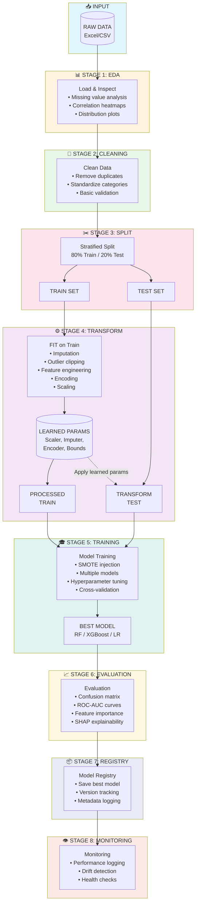
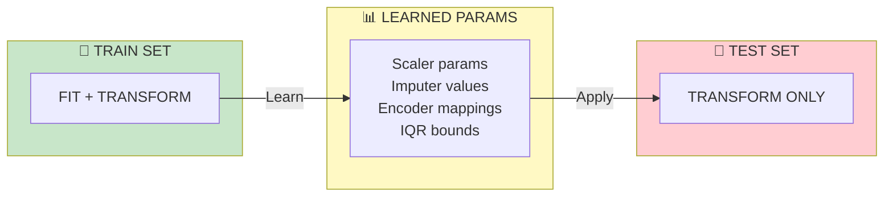
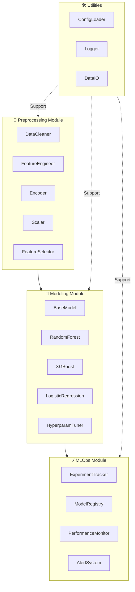
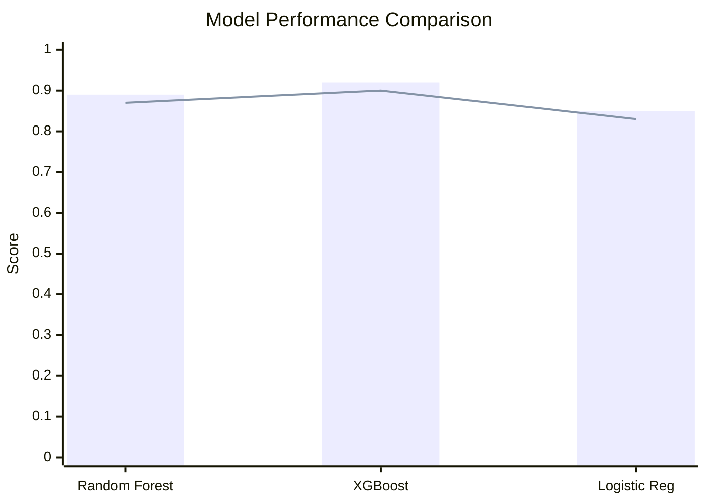

# 🔄 Customer Churn Analysis & Prediction


## 📋 Tổng quan (Overview)

Dự án này không chỉ là một bài toán phân loại Machine Learning thông thường. Đây là một hệ thống **Software Engineering for Data Science** hoàn chỉnh, giải quyết bài toán dự đoán khách hàng rời bỏ (Customer Churn) cho lĩnh vực Thương mại điện tử (E-Commerce).

> 💡 Khác với việc chạy code trên Jupyter Notebook rời rạc, hệ thống này được xây dựng thành một **Pipeline khép kín**, có khả năng tái sử dụng (reproducible), dễ dàng mở rộng (scalable) và tích hợp sẵn quy trình **MLOps tự xây dựng** (Custom MLOps).

### 💼 Giá Trị Kinh Doanh (Business Value)

| Giá trị | Mô tả |
|---------|-------|
| 🎯 **Sàng lọc sớm** | Nhận diện khách hàng có nguy cơ rời bỏ với độ chính xác cao (F1-Score > 0.90) |
| 🔍 **Hiểu hành vi** | Sử dụng SHAP để giải thích lý do khách hàng rời bỏ (VD: Do thời gian giao hàng, hay do ít nhận được ưu đãi) |
| 💰 **Tối ưu chi phí** | Giúp bộ phận Marketing khoanh vùng đúng đối tượng để gửi voucher giữ chân, tránh lãng phí ngân sách |

---

## 🏗️ Kiến trúc hệ thống (System Architecture)

### Pipeline Flow



### 🔐 Key Principle: NO DATA LEAKAGE



---

## 🧩 Logic xử lý (Logical Components)



---

## 📁 Project Structure

```
📦 Churn_Analysis_and_Predict/
├── 📂 config/
│   └── 📄 config.yaml                    # Central configuration file
│
├── 📂 src/                               # Source code modules
│   ├── 📄 __init__.py
│   ├── 📄 utils.py                       # Logging, IO, config handling
│   ├── 📄 preprocessing.py               # Data preprocessing pipeline
│   ├── 📄 modeling.py                    # Model training & evaluation
│   ├── 📄 visualization.py               # Plotting & visualization
│   ├── 📄 ops.py                         # MLOps: tracking, registry, monitoring
│   └── 📄 pipeline.py                    # Main pipeline orchestrator
│
├── 📂 data/                              # [WORKSPACE] Latest working files
│   ├── 📂 raw/
│   │   └── 📄 E_Commerce.xlsx            # Raw input data
│   ├── 📂 processed/
│   │   └── 📄 E_Commerce_cleaned.parquet # Cleaned data
│   └── 📂 train_test/
│       ├── 📄 E_Commerce_train.parquet   # Latest train split
│       └── 📄 E_Commerce_test.parquet    # Latest test split
│
├── 📂 artifacts/                         # [ARCHIVE] Historical results
│   ├── 📂 experiments/                   # Run-specific snapshots
│   │   └── 📂 20251205_203000_FULL/      # Example run ID
│   │       ├── 📄 config_snapshot.yaml
│   │       ├── 📄 params.json
│   │       ├── 📄 metrics.json
│   │       ├── 📄 run.log
│   │       ├── 📂 figures/
│   │       │   ├── 📂 eda/
│   │       │   └── 📂 evaluation/
│   │       ├── 📂 models/
│   │       │   ├── 📄 preprocessor.joblib
│   │       │   └── 📄 xgboost.joblib
│   │       └── 📂 data/
│   │           ├── 📄 processed.parquet
│   │           ├── 📄 train.parquet
│   │           └── 📄 test.parquet
│   │
│   ├── 📂 model_registry/                # Production models
│   │   ├── 📄 registry.json
│   │   └── 📄 xgboost_v1_20251205.joblib
│   │
│   ├── 📂 versions/                      # Data lineage tracking
│   │   └── 📄 versions.json
│   │
│   ├── 📂 monitoring/                    # Model monitoring data
│   │   ├── 📄 performance_log.csv
│   │   └── 📄 alerts_log.csv
│   │
│   └── 📂 logs/
│       └── 📄 MAIN_20251205.log
│
├── 📄 main.py                            # CLI entry point
├── 📄 requirements.txt                   # Python dependencies
└── 📄 README.md                          # This file
```

---

## 🚀 Hướng dẫn sử dụng (Usage Instructions)

### 1️⃣ Clone repository

```bash
git clone https://github.com/civi0411/Churn_Analysis_and_Predict.git
cd Churn_Analysis_and_Predict
```

### 2️⃣ Create Virtual Environment (Recommended)

```bash
python -m venv venv
source venv/bin/activate  # On Windows: venv\Scripts\activate
```

### 3️⃣ Install dependencies

```bash
pip install -r requirements.txt
```

### 4️⃣ Configure settings

Edit `config/config.yaml` to set paths, model parameters, etc.

### 5️⃣ Usage Modes

#### 🔄 Full Pipeline (Recommended)

Tự động thực hiện: Clean → Split → Train → Optimize → Visualize → Save Artifacts

```bash
python main.py --mode full --model xgboost --optimize
```

#### 🔧 Step-by-Step Execution

```bash
# Exploratory Data Analysis
python main.py --mode eda

# Preprocessing
python main.py --mode preprocess

# Train specific model
python main.py --mode train --model xgboost

# Full pipeline with all models
python main.py --mode full

# Visualization only
python main.py --mode visualize
```

### 6️⃣ Chạy kiểm thử (Testing)

```bash
# Chạy toàn bộ test
pytest

# Chạy riêng phần Unit Test (Test hàm lẻ)
pytest tests/test_module

# Chạy riêng phần Integration Test (Test luồng)
pytest tests/test_flow
```

---

## 📊 Model Comparison



---

## 🤝 Contributing

Contributions are welcome! Please feel free to submit a Pull Request.

## 📝 License

This project is licensed under the MIT License - see the [LICENSE](LICENSE) file for details.

---

<p align="center">
  Made with ❤️ by <a href="https://github.com/civi0411">civi0411</a>
</p>

