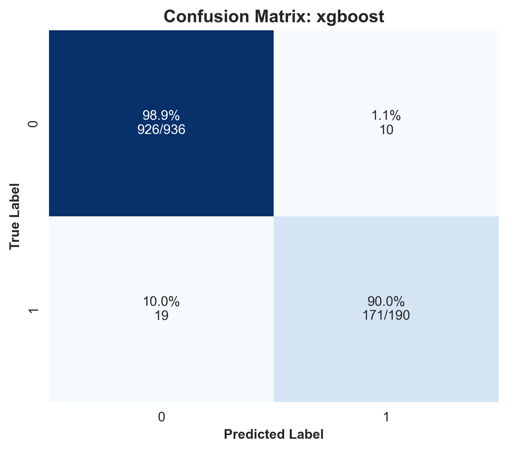
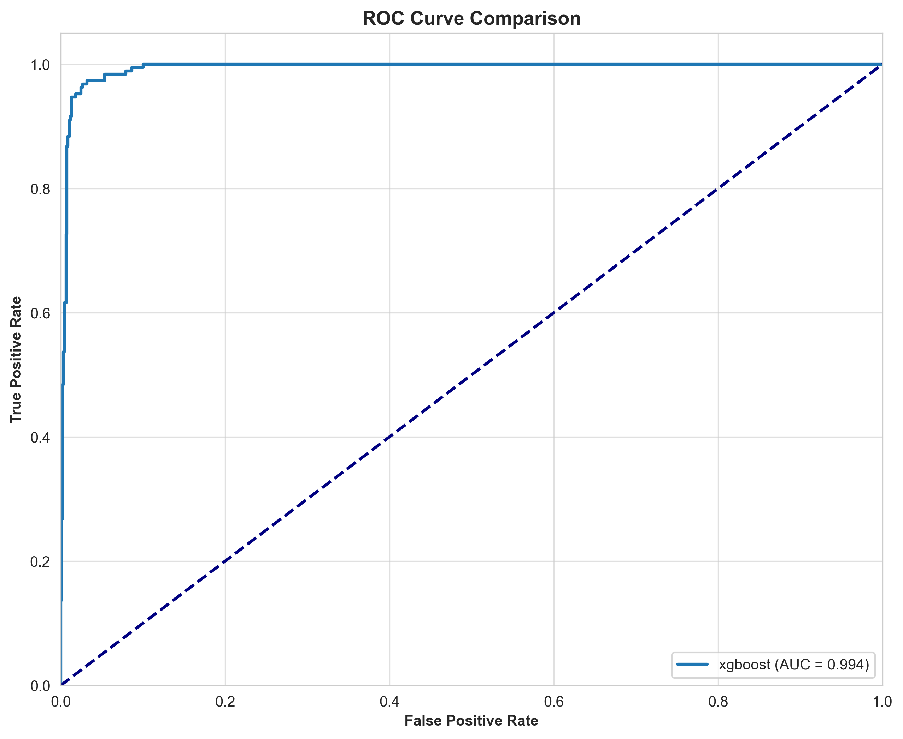
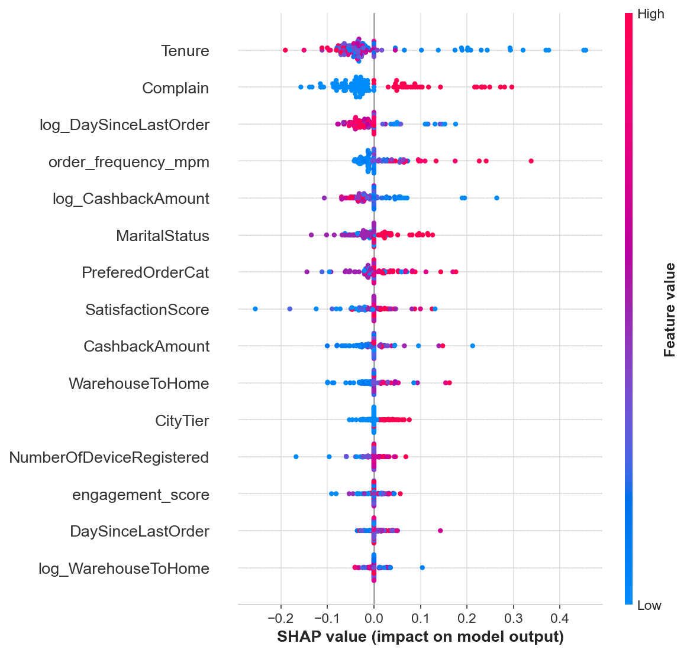

# ML Pipeline Report - Run 20251211_214017_TRAIN

**Generated:** 2025-12-11 21:40:31

---

## Run Information

| Parameter | Value |
|:----------|:------|
| **Run ID** | `20251211_214017_TRAIN` |
| **Mode** | `TRAIN` |
| **Optimize** | `True` |
| **Data Source** | `data/raw/E Commerce Dataset.xlsx` |
| **Test Size** | `0.2` |
| **Best Model** | `xgboost` |

---

## Model Training & Evaluation

**Best Model:** XGBOOST

### Metrics

| Model | Accuracy | Precision | Recall | F1 | ROC-AUC |
|:------|:--------:|:--------:|:------:|:--:|:-------:|
| XGBOOST | 0.9742451154529307 | 0.9447513812154696 | 0.9 | 0.9218 | 0.9936122357174989 |

### Feature Importance

| Feature | Importance |
|:--------|:----------:|
| Tenure | 0.23692870140075684 |
| Complain | 0.12387628853321075 |
| MaritalStatus | 0.11952105164527893 |
| NumberOfDeviceRegistered | 0.07710175216197968 |
| PreferedOrderCat | 0.07268063724040985 |
| log_DaySinceLastOrder | 0.05715984106063843 |
| SatisfactionScore | 0.050858352333307266 |
| CityTier | 0.0485205352306366 |
| DaySinceLastOrder | 0.041351318359375 |
| order_frequency_mpm | 0.035850562155246735 |
| CashbackAmount | 0.03165195882320404 |
| log_CashbackAmount | 0.03055673837661743 |
| WarehouseToHome | 0.027825333178043365 |
| engagement_score | 0.025500426068902016 |
| log_WarehouseToHome | 0.020616374909877777 |

### Evaluation Visualizations

#### Confusion Matrix Xgboost

Ma trận nhầm lẫn giúp đánh giá chi tiết các loại lỗi của mô hình.

#### Feature Importance Top 20

Biểu đồ này cho thấy các đặc trưng quan trọng nhất ảnh hưởng đến dự đoán churn.

#### Model Comparison

#### Roc Curve

Đường cong ROC cho thấy khả năng phân biệt giữa các lớp của mô hình.

#### Shap Summary

---

---

_Report auto-generated by ML Pipeline_
