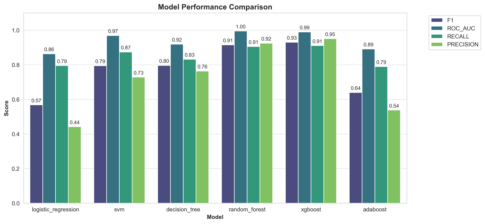
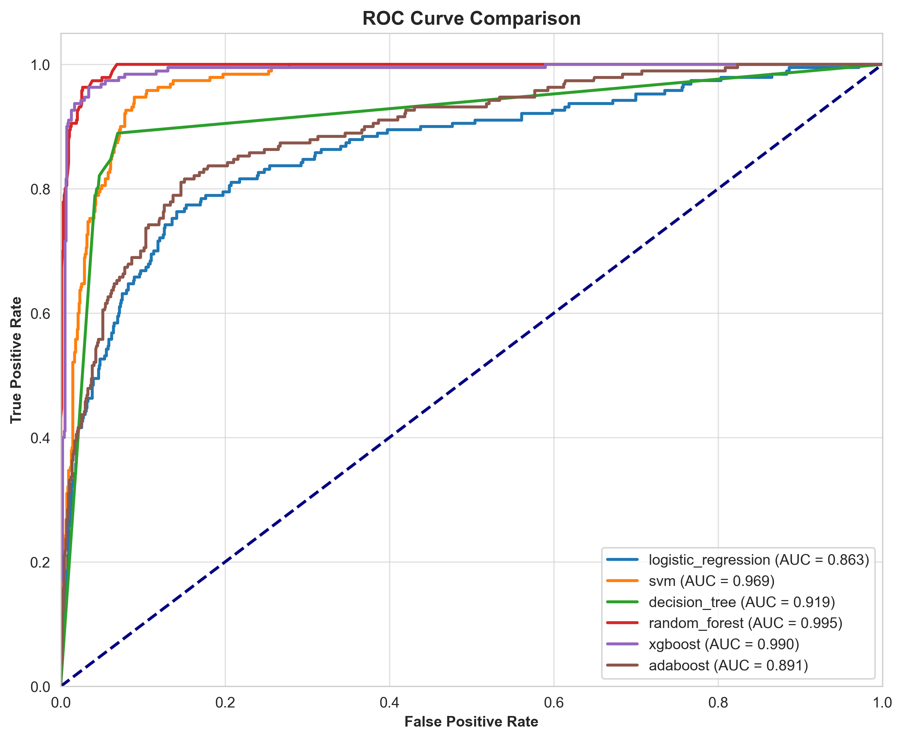

# ML Pipeline Report - Run 20251211_214047_TRAIN

**Generated:** 2025-12-11 21:41:52

---

## Run Information

| Parameter | Value |
|:----------|:------|
| **Run ID** | `20251211_214047_TRAIN` |
| **Mode** | `TRAIN` |
| **Optimize** | `True` |
| **Data Source** | `data/raw/E Commerce Dataset.xlsx` |
| **Test Size** | `0.2` |
| **Best Model** | `xgboost` |

---

## Model Training & Evaluation

**Best Model:** XGBOOST

### Metrics

| Model | Accuracy | Precision | Recall | F1 | ROC-AUC |
|:------|:--------:|:--------:|:------:|:--:|:-------:|
| LOGISTIC_REGRESSION | 0.7957371225577264 | 0.4415204678362573 | 0.7947368421052632 | 0.5677 | 0.8631129104813314 |
| SVM | 0.9236234458259325 | 0.7280701754385965 | 0.8736842105263158 | 0.7943 | 0.9686572199730094 |
| DECISION_TREE | 0.9280639431616341 | 0.7632850241545893 | 0.8315789473684211 | 0.7960 | 0.9188624606387764 |
| RANDOM_FOREST | 0.9715808170515098 | 0.9247311827956989 | 0.9052631578947369 | 0.9149 | 0.9950320512820512 |
| XGBOOST | 0.9769094138543517 | 0.9505494505494505 | 0.9105263157894737 | 0.9301 | 0.9895411605937922 |
| ADABOOST | 0.849911190053286 | 0.5376344086021505 | 0.7894736842105263 | 0.6397 | 0.8912280701754387 |

### Feature Importance

| Feature | Importance |
|:--------|:----------:|
| Tenure | 0.2415221780538559 |
| Complain | 0.12834039330482483 |
| MaritalStatus | 0.1102534607052803 |
| NumberOfDeviceRegistered | 0.08172532171010971 |
| PreferedOrderCat | 0.07374565303325653 |
| SatisfactionScore | 0.052485186606645584 |
| CityTier | 0.05113154277205467 |
| log_DaySinceLastOrder | 0.05059542879462242 |
| DaySinceLastOrder | 0.044802986085414886 |
| order_frequency_mpm | 0.031380776315927505 |
| log_CashbackAmount | 0.03134201839566231 |
| WarehouseToHome | 0.02911561354994774 |
| CashbackAmount | 0.027536211535334587 |
| engagement_score | 0.024935007095336914 |
| log_WarehouseToHome | 0.021088289096951485 |

### Evaluation Visualizations

#### Confusion Matrix Xgboost

Ma trận nhầm lẫn giúp đánh giá chi tiết các loại lỗi của mô hình.

#### Feature Importance Top 20

Biểu đồ này cho thấy các đặc trưng quan trọng nhất ảnh hưởng đến dự đoán churn.

#### Model Comparison

#### Roc Curve

Đường cong ROC cho thấy khả năng phân biệt giữa các lớp của mô hình.

#### Shap Summary

---

---

_Report auto-generated by ML Pipeline_
